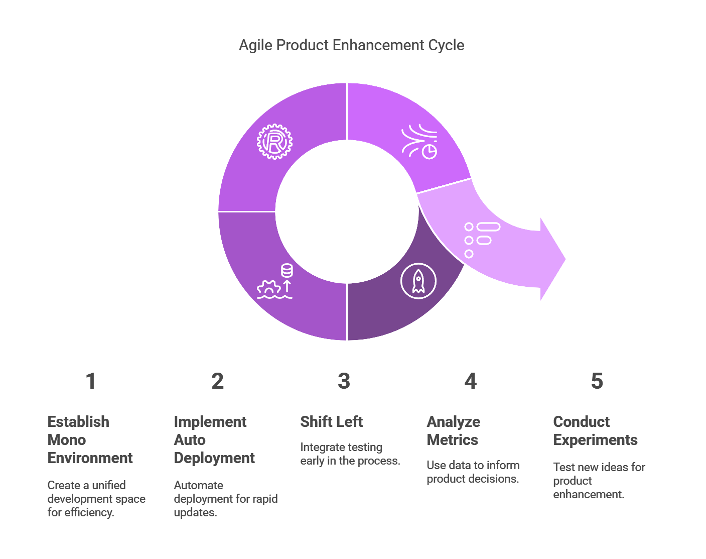
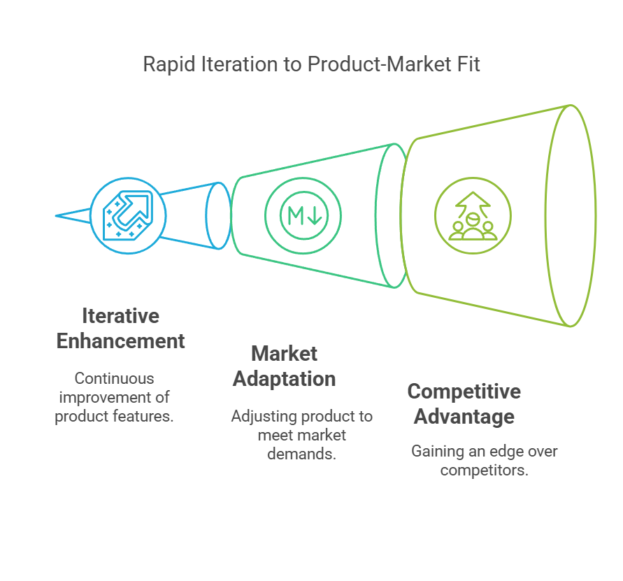
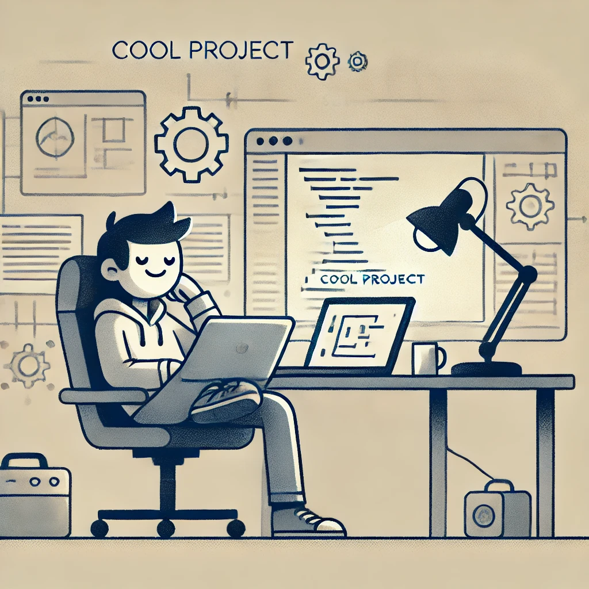

## What does the customer want?

Ultimately, customer's have a problem that they need to solve, and to solve the problem they will look to the market to find a product that does this for them. As the creators of a product, we need to ensure that our developed product fits the customer's needs, this is the [product market fit](https://www.productplan.com/glossary/product-market-fit/).

Finding this product market fit almost always involves iteration and innovation, as you're very unlikely to get it right first time out. Therefore, getting the product out there to collect customer feedback and continuously enhancing the product to address their problem is the way forward.

This feedback loop, drives customer engagement and desire for the products, ultimately driving sales providing value to the business and keeps you in the job. So this should also be what you want!

## Building the product pipeline

To gain the true benefit of the customer feedback loop the product pipeline must be constructed to allow enhancements to be made to the product as regular as possible, even multiple times a day!

Now to build this pipeline, a simple recipe can be followed:

### Step 1 - Mono Environment

Mono environment refers to having a single environment to which our product (the code) is deployed. No staging, no UAT, just production. This removes the "standard" promotion pattern of deployment which slows how quickly you can get the product to your customer's.

One concern with a mono environment, is that code, functionality and features must be delivered in chunks. This must be avoided to reduce the risk of outages or issues on both the existing product and the new features. The solution is to involve "dark launching" or "feature flags" in production. This means deploying iterable chunks of code into production, hidden from the customer's using conditional logic based on the user interacting with our product.

### Step 2 - Auto Deployment

Now we have a mono environment, let's speed up delivery even more! A Continuous Deployment (CD) pipeline is critical, not just a Continuous Integration (CI) pipeline. Once we merge our code and validate it is correct, there is nothing else to do with only one environment but ship it to prod!

To make this easier, [trunk based development](https://trunkbaseddevelopment.com/) approach to version control simplifies everything. This makes it clear to all contributors that what is deployed in production is what is merged to the main branch.

### Step 3 - Shift Left

We have one environment and everything merged to main is auto-deployed, how do we gain confidence in what we deploy?  Without staging or UAT environments to hide behind, we need to [shift left](https://en.wikipedia.org/wiki/Shift-left_testing) for our testing. This also means that as product engineers, we have to wear our QA caps. One very good way to ensure this is to follow a [Test Driven Development (TDD)](https://martinfowler.com/bliki/TestDrivenDevelopment.html) approach. Writing our tests before implementing the feature to ensure what we test accurately represents the behaviour we desire.

Shifting left doesn't, and shouldn't, stop at testing. Given we are always auto-deploy to production, we should also toss in our infrastructure and security concerns. If we're deploying on any modern cloud solution, luckily we can leverage [terraform](https://www.terraform.io/) for our needs. This empowers our shiny CD pipeline to also ensure that any compute, event, monitoring, etc. is in place when we move straight to production.

Likewise, for security, we should ensure our CI pipeline is equipped to scan our package dependencies **and** the artifact(s), often a Docker image, that will be deployed. One key thing we can't avoid is that vulnerabilities can be discovered **after** we have deployed our product. This means we can't solely rely on only the CI pipeline to protect us, since it only runs when we make changes. So additional continuous scanning must be employed to keep our product, and the customer's, safe.

### Step 4 - Metrics

The product is ready to be used by the customers, we are able to rapidly enhance and make changes to it with our strong engineering pipeline. What is missing? How do we know what our customers want? How do we know the product is succeeding? We should do what any scientific field does, measure it!

There are a huge range of products out there to help gather, store, view, represent and explore user metrics. Covering these is not the point of this discussion, we we'll digress. What we want to measure is our customers interaction with our feature flows/journeys:

1. What features customers are using
2. How long it takes them to go through various feature journeys
3. Customer drop off rate through a journey

With this, we can see what features benefit customers, pinpoint potential bottlenecks in the flow and identify friction points.

### Step 5 - Experiment

Finally, we can use all these gathered metrics to improve our product. Firstly, by leveraging the usage, we can prioritise what are the high value features to work on. Then roll out experimental changes behind our feature flags, targetting reducing drop-off and/or speeding up journeys. Using segmentation functionality of the feature flags we can [A-B test](https://www.optimizely.com/optimization-glossary/ab-testing/) our changes to determine if there was a real improvement for our customers!

This gives us everything we need to ship a ~~successful~~ product. This doesn't guarantee that what is delivered to the customer will be considered successful. However, it does let us iterate, enhance or even change what the product is, extremely rapidly. This empowers us to find [product market fit](https://www.productplan.com/glossary/product-market-fit/), stay ahead of competitors or adapt to external influences/changing market.

## Scaling the product business

Having a good recipe when you cook doesn't mean you can run a restaurant. You need to be able to scale being a lone cook to a large operation by scaling through others. For software engineering, the first thing to start with is a set of **core principals** that are agreed upon by all of product engineering, non-engineers included too. This will act as a core tenant for the teams, regardless of how they're structured (tribes, squads, etc.), to ensure that independent design decisions made by each team is aligned without the need to constantly communicate. This removes those far to often "sync" meetings to ensure everyone is on the same page, because we have already agreed on how we make decisions. When selecting these principals, it is best to keep them simple and few for clarity. For example:

1. Loose coupling - strong cohesion
2. TODO:

With high level principals in place, now we can focus on the architecture. This is where the abstract principals need to become concrete implementations. There are a few design philosophies that can be followed, but I would suggest [Domain Driven Design (DDD)](https://martinfowler.com/bliki/DomainDrivenDesign.html) as the primary choice. The argument I'll make for it is that it allows us to divide our teams by domains, and more importantly ownership of data. The stickiest part of any piece of software is the data. By this I mean that if we mess up a design decision, the hardest thing to change is always the data and the data models. By giving strong ownership to a team for the data within a domain, they have the best chance of getting it right. But also if they don't get it right, they have the most skin in the game when it goes wrong. 

This touches on another factor, and that is team ownership and responsibilities. Getting team structure correct is more critical for the health of the codebase than you may initially think. There is a common phenomenon that occurs where the organisation structure reflects 1:1 with the structure of the code. This means if there is conflict or lack of clarity for team ownership, the same will manifest in the code; warring implementation details, throwing of concerns over the fence, or stepping on each others toes. This all does the opposite of what we're trying to achieve above, going fast!

## Being Selfish

Another hidden benefit, more selfish than helping customers, is this method of software development if significantly more pleasant to work on and more self gratifying. Being agile in enhancing a product reduces our own feeling of friction and pain points. This increase to the developer experience almost entirely removes process bureaucracy and eliminates those silly hoops we are sometimes forced to jump through. If nothing else, don't do this for the product, do it for yourself.

Finally, the other selfish benefit is that if the business we are a part of is doing well, we get more license to take control of the way of working and build cool stuff!

