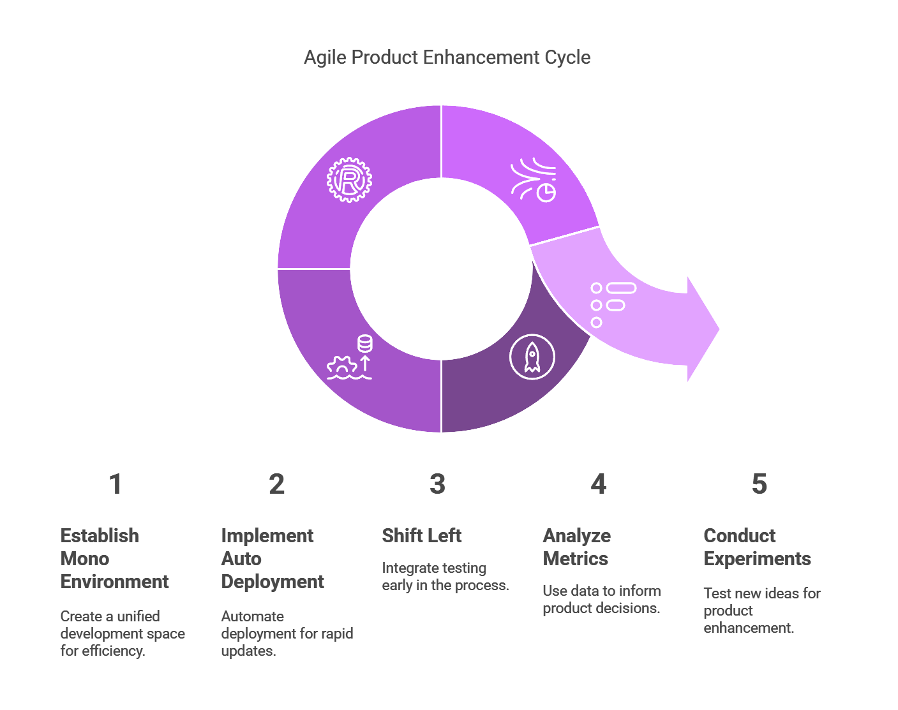
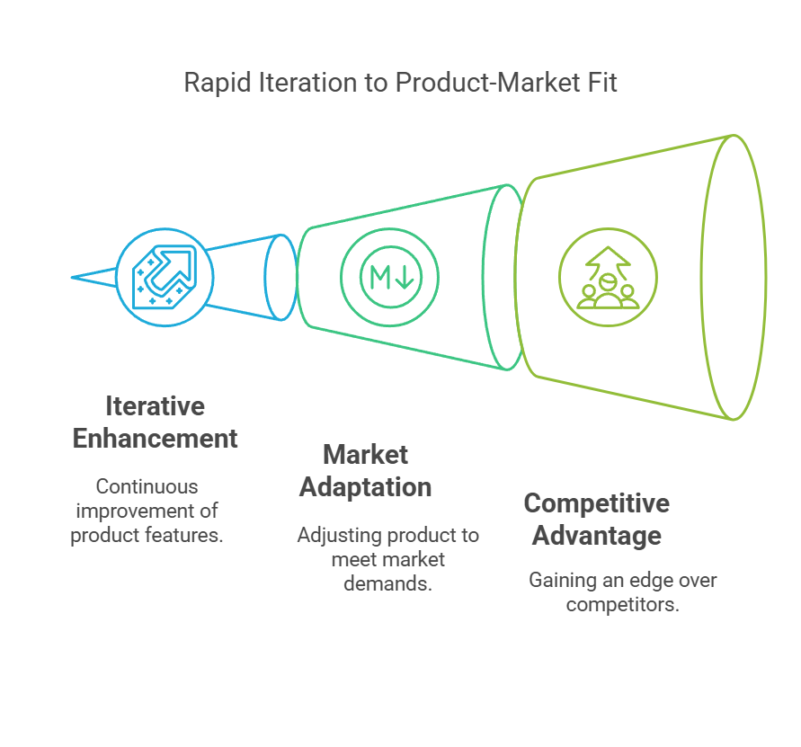

## What does the customer want?

Ultimately, customer's have problems they need solving, and to do this they will look to the market to find a product that solves it for them. As the creators of a product, we need to ensure the product we have fits this customer need. This is known as the [product market fit](https://www.productplan.com/glossary/product-market-fit/).

Finding this product market fit almost always involves iteration and innovation, as you're very unlikely to get it right on the first time out. Therefore, the most critical thing to do is get a product out there, trial it with the customers, collect feedback and continuously enhancing the product to address the needs.

This feedback loop also drives customer engagement, generates interest, and increases the customer's desire for the product. Ultimately, this will drive sales, which providing profit to the business and keeps you in the job. So this should also be what you want!

## Building the product pipeline

To gain the true benefit of the customer feedback loop the product pipeline must be constructed to allow iterations and enhancements of the product as regular as possible, even multiple times a day!

Now to build this pipeline, a simple recipe can be followed 👨‍🍳:

### Step 1 - Mono Environment

Mono environment refers to having a single environment to which our product (the code) is deployed. No staging, no UAT, just production. This removes the "standard" environment promotion pattern of deployment which slows delivery speed of the product to the customer.

With a mono environment, we still want to deliver our functionality and features in pieces to allow us to verify them and reduce the risk of outages or issues, whilst at the same time avoiding disruption of the customer experience. The solution is to "dark launch" or "feature flag" these pieces in production. This means deploying iterable chunks of code into production, hidden from the customer's using conditional logic based on the user interacting with our product. This allows us to maintain a stable experience for the customer, and actually validate our product in the exact same environment the end customer will be using it. This avoids the overhead of promoting code through environments, managing multiple versions, and reducing risk of missing something during deployment (i.e. infrastructure change or code commit).

### Step 2 - Auto Deployment

Now we have a mono environment, let's speed up delivery even more! A Continuous Deployment (CD) pipeline is critical, not just a Continuous Integration (CI) pipeline. Once we merge our code and validate it is correct (tests, lint, scans, etc.), there is nothing else to do with only one environment but ship it to prod! The CD pipeline will automatically deploy all our changes into production, ready for us to do any verification we desire.

To make this easier, [trunk based development](https://trunkbaseddevelopment.com/) approach to version control simplifies everything. Without any other environments to support, this is the clear choice of how we should manage our version control. There is no need to patch previous versions, or create stable releases, if there is an issue we either rollback or roll-forward whilst maintaining the core branch. This also makes it clear to all contributors that what is deployed in production is what is merged to the main branch, giving them confidence of the behaviour of their changes relative to what is deployed.

### Step 3 - Shift Left

We have one environment and everything merged to main is auto-deployed, how do we gain confidence in what we deploy?  Without staging or UAT environments to hide behind, we need to [shift left](https://en.wikipedia.org/wiki/Shift-left_testing) for our testing. This also means that as product engineers, we have to wear our QA caps. A solid approach to ensure this is to follow a [Test Driven Development (TDD)](https://martinfowler.com/bliki/TestDrivenDevelopment.html) approach. This involves writing tests to validate the behaviour of our functionality before implementing it. Paired with an outside-in approach, where we interact with the functionality from the outer bounds of the system and measure side-effects, gives us the confidence we need.

Shifting left doesn't, and shouldn't, stop at testing. Given we are always auto-deploy to production, we should also toss in our infrastructure and security concerns. If we're deploying on any modern cloud solution, luckily we can leverage [terraform](https://www.terraform.io/) for our needs. This empowers our shiny CD pipeline to also ensure that any compute, event, monitoring, etc. is in place when we move straight to production.

Likewise, for security, we should ensure our CI pipeline is equipped to scan our package dependencies **and** the artifact(s), often a Docker image, that will be deployed. One key thing we can't avoid is that vulnerabilities can be discovered **after** we have deployed our product. This means we can't solely rely on only the CI pipeline to protect us, since it only runs when we make changes. So additional continuous scanning must be employed to keep our product, and the customers, safe.

### Step 4 - Metrics

The product is ready to be used by the customers, we are able to rapidly enhance and make changes to it with our strong engineering pipeline. What is missing? How do we know what our customers want? How do we know the product is succeeding? We should do what anyone in a scientific field does, measure it!

There are a huge range of products out there to help gather, store, view, represent and explore user metrics. Covering these is not the point of this discussion, so I'll digress. What we want to measure is our customers interaction with our feature flows/journeys:

1. What features customers are using
2. How long it takes them to go through various feature journeys
3. Customer drop off rate through a journey

With this, we gain insights into customer behaviour to understand which features benefit them, pinpoint potential bottlenecks in the flow, and identify friction points.

### Step 5 - Experiment

Finally, we can use all these gathered metrics to improve our product. Firstly, by leveraging the feature usage data, we can prioritise what are the high value features to work on. Then roll out experimental changes to improve feature adoptions, reduce drop-off, and/or speed up journey, all deployed behind our feature flags. By using segmentation functionality of the feature flags we can [A-B test](https://www.optimizely.com/optimization-glossary/ab-testing/) our changes to determine if there was a real improvement for our customers!

This gives us everything we need to ship a ~~successful~~ product. This doesn't guarantee that what is delivered to the customer will be considered successful. However, it does let us iterate, enhance or even change what the product is, extremely rapidly. This empowers us to find product market fit, stay ahead of competitors or adapt to external influences/changing market, making us seem like the obvious choice for customers.

## Scaling the product business

Having a good recipe when you cook doesn't mean you can run a restaurant. You need to be able to scale being a lone cook to a large operation by scaling through others. For software engineering, the first thing to start with is a set of **core principals** that are agreed upon by all of product engineering, non-engineers included too. This will act as a core tenet for the teams, regardless of how they're structured (tribes, squads, etc.), to ensure that independent design decisions made by each team is aligned without the need to constantly communicate. This removes those far to often "sync" meetings to ensure everyone is on the same page, because we have already agreed on how we make decisions. When selecting these principals, it is best to keep them simple and few for clarity. For example:

1. Always Be Consistent - Preferring consistency over other factors for [CAP theorem](https://www.ibm.com/think/topics/cap-theorem)
2. Security By Design - Always having security concerns at the core of any design
3. Simplicity & Maintainability - Picking tools, frameworks and technology that are tried and tested and works for now and future

With high level principals in place, now we can focus on the architecture. This is where the abstract principals need to become concrete implementations. There are a few design philosophies that can be followed, but I would suggest [Domain Driven Design (DDD)](https://martinfowler.com/bliki/DomainDrivenDesign.html) as the primary choice. The argument I'll make for it is that it allows us to divide our teams by domains, and more importantly divide by ownership of data. The stickiest part of any piece of software is the data. By this I mean that if we mess up a design decision, the hardest thing to change is always the data, data models, and storage. By giving strong ownership to a team for the data within a domain, they have the best chance of getting it right. But also if they don't get it right, they have the most skin in the game when it goes wrong, giving incentive to avoid this at all cost.

This touches on another factor, and that is team ownership and responsibilities. Getting team structure correct is more critical for the health of the codebase than you may initially think. There is a common phenomenon that occurs where the organisation structure reflects 1:1 with the structure of the code. This means if there is conflict or lack of clarity for team ownership, the same will manifest in the code; warring implementation details, throwing of concerns over the fence, or stepping on each others toes. This all does the opposite of what we're trying to achieve above, going fast!

## Being Selfish

Another hidden benefit, more selfish than helping customers, is this method of software development if significantly more pleasant to work on and more self gratifying. Being agile in enhancing a product reduces our own feeling of friction and pain points. This increase to the developer experience almost entirely removes process bureaucracy and eliminates those silly hoops we are sometimes forced to jump through. If nothing else, don't do this for the product, do it for yourself.

Finally, the other selfish benefit is that if the business we are a part of is doing well, we get more license to take control of the way of working and build cool stuff!

