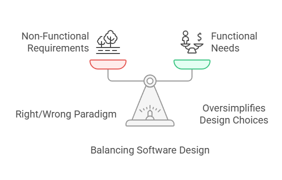

## Sharing Ideas and Knowledge

Across all aspects of what humans do, it is critical that we share our knowledge and ideas, so that we can build from the work of those who have come before us and continue progressing forward. Software engineering is a new field relative to the expanse of human knowledge collection. As such, it is a rapidly evolving industry where there is a constant stream of knowledge to keep up with. This can be extremely daunting, especially with the expectation of some employers for engineers do learning in their personal time.

There are many different ways to share and learn from each other, but one of the main ones I've always been suggested was books. However, as the title of this may allude to, I don't think they're the best way to learn. So let's be a little controversial and make an argument against books!

## Books: Good and Bad

Before the pitchforks come out, we will start by just doing a simple pros and cons of books for the purpose of learning and keeping up with the software engineering sphere. Firstly, they are an excellent resource given the fact that the form factor allows them to deeply explore and express a topic, aspect, or principal of software engineering. However, by the same metric they are extremely dense, so can be daunting and unapproachable for a lot of people.

The other benefit of books is they have a high barrier to entry for producing a book. Compared to writing a blog (this site costs literally $0 to host/maintain) or online forums (Stack Overflow, Reddit, etc.) it costs real money to publish and distribute a book. This means there is an argument to be made that more thought goes into the content of a book, so they are higher quality. By the same metric, the cost of purchasing a book can be seen as gatekeeping of knowledge in some ways. Some will be made to believe that purchasing software engineering books and curating a personal library is simply a requirement of the industry. Luckily, there are a lot of libraries, or free means of acquiring books that can be used to alleviate this friction.

Whilst a book is more likely to be higher quality, the nature of the media also means the content is static, so can't easily be updated if there are errors or even if they become outdated relative to current thinking or trends. This leads to my other key argument against books, they are a one-sided form of media, which restricts the discussion or feedback the consumer can have with the author. It is also much harder to ask questions or get clarifications for what is being presented.

This leads to my more potentially controversial opinion on books, which is they are often designed to convey or explore a "right" design. I would argue this is a false dichotomy in software design of "right" and "wrong" solutions to a problem. This can be at a cost of not considering balancing [non-functional requirements](https://en.wikipedia.org/wiki/Non-functional_requirement) with product functionality for a given use-case. As a result, this can sometimes result in an anti-pattern of [silver bullet](https://en.wikipedia.org/wiki/No_Silver_Bullet) or [golden hammer](https://www.techtarget.com/searchapparchitecture/tip/Signs-of-a-Golden-Hammer-antipattern-and-ways-to-avoid-it) emerging for readers without critical thinking for applying what is covered to their given situation. This is exacerbated by the lack of feedback or discussion channel for the medium of books.

The final downside to a book is also that they are often a dense and long form of media. Given that there is an expectation from employees that you are continuously learning and keep up with modern technologies (extremely hard as a front-end engineer with all those JS/TS frameworks). For most people that like a work-life balance, this means that books, whilst they do have chunks in forms of chapters, might not suite all people.

## Teaching Children

What is learning? A good place to start is to look at what we learn when we're younger. Schools and universities uses a layered approach to learning. This is where knowledge is built up from a wide, generalised base to begin with before adding specialisation. As a result of building up this wider knowledge base, we are able to take on the specialised learning at a more rapid rate, as well as, being better at relating similar concepts. This is a similar idea to what is presented in [the illustrated guide to a Ph.D.](https://matt.might.net/articles/phd-school-in-pictures/) by Matt Might.

This learning approach should really be no different to how we should continue to learn as a "fully fledged" software engineer. The comparison I would suggest is that "a book to an engineer, is effectively what a Ph.D. is to a first year uni student". Whilst the book is a good resource, without the layering of learning, the knowledge it contains can be overspecialised for the audience itself; this effectively weakens its use to further the growth. As such, before picking up a book to learn more, you should first expand a wider knowledge base in that area. For example, as interesting or well constructed a book about [C++ Template Metaprogramming](https://www.amazon.co.uk/Template-Metaprogramming-Concepts-Techniques-Beyond/dp/0321227255) may be, if you don't have a basis for C++ templates, C/C++, compiler, or low level language, then the book will only be so useful.

I myself fell into this issue in high school. In high school, I was always interested in Science and Engineering, however, my school only gave the option of Physics or Chemistry, there were no Engineering classes, let alone Software Engineering. I wanted to learn more about how computers worked and how to get them to do cool stuff. "Easy", I told myself, "computers are made of silicon semiconductors, I learnt that from physics!". So I went and found a book about that, it was something like this [Semiconductor Fundamentals](https://link.springer.com/chapter/10.1007/978-3-030-02171-9_1) book I found online. Turns out, the book was mostly about physics fundamentals of electron movement, silicon doping, quantum mechanics, and lots of maths. Super neat, but arguably a pretty big waste of time, especially given what I'm actually doing. Software Engineering.

If I had first built a wider knowledge base, I could have used that to progress the knowledge in the direction of what actually interested me. This way you get to dip your toe in and find out what excites you, and I would have a better foundation on which my knowledge was building. This is what Matt Might is getting at with his diagram of the layered learning:

## How Else to Learn?

Well, if only it was that simple. The hardest part is always the human factor. We are not a "one-size fits all" kind of species, so unfortunately finding the best way to learn is homework for you, the reader. As outlined before, it is crucial when looking what works best for you to consider how it will fit into your schedule/lifestyle, so what works best will be different depending on your stage of life too. So lets look at some other options!

### Articles and Forums

Like this, they aim to be small, bit-size, chunks of consumable content that are easy to digest. These are often ideal for building the wide base of knowledge prior to specialisation of denser content like a book. These forms often come with feedback in the form of comments (maybe coming soon here?) which allows for ideas to be challenged, use-cases to be discussed, and alternative suggestions to be provided.

### Conversations

You'll have these in your day-to-day anyway, and I know many might already think they talk to their colleagues too much already in all those meetings. However, challenge yourself to still talk to them outside of these situations to see what random bits of knowledge you might discern from them. Maybe one day these nuggets will be gold! After all, most software engineers are hardcore nerds, or dabbling at a minimum, so talking about tech should be pretty fun for all!

### Try (and Fail)

Reading and talking are great, but if you really want to get to know something well, go try it! Even better, if you do something and it fails, you will usually learn much more than if it magically works the first time. Want to use a new piece of tech? A new library? Even some new tools? Don't start by trying to apply it to a large, already established project, go make a quick test project and apply it on a small scale. The most important part is once something works, don't just stop there, mess around with it. There are often multiple ways to solve a problem, each with their own nuances, pros, and cons. Understand these small differences will greatly improve your ability to design and architect better solutions.

### Critical or Deep Thinking

This worked perfectly well when exploring concepts of [general and special relativity](https://en.wikipedia.org/wiki/Einstein%27s_thought_experiments), so why stop there? Walk through ideas and implementations in your head or on a piece of paper. Draw boxes, scribble lines, scrunch up the paper and throw it at the wall in frustration. It all helps in the end. Often some of my best ideas come when I'm day dreaming, often in the shower. I'll then rush to actively think through the idea that just struck me, drawing lines in the fog of the shower glass. Then I'll rush out to get it down on paper before it is gone.

Ultimately, books are one of many methods to learning and growing as an engineer. Like languages, frameworks, and tools, it should just be another utility in your back-pocket to become a strong, well rounded software engineer, capable of solving any problem.
