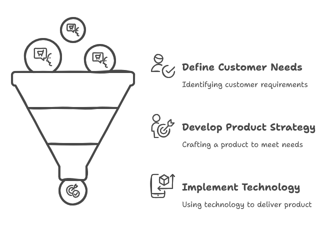

## Where to Begin

When starting a new project, building a new product or enhancing something that already exists it is important to determine how we are going to solve this problem in front of us. Often, as software engineers, we think the first question to answer is what technologies, frameworks or programming languages we would like to use. But is this really the right first question to answer?

## Inverted Problem

People are selfish. It isn't really their fault, that's just often the nature of being human. What we are interested in are coloured by our own experiences, since this is the only [primary source](https://en.wikipedia.org/wiki/Primary_source) we have to rely on. As such, we think the first question to be answered is how we will build the solution. However, in reality this should be the last question to ask. Therefore, we must invert our understanding of the problems.

To work out what question to ask first, we should think about how the project or product derives success. Success of this depends primarily on the consumer of the project or product, the customer. Therefore, the questions should be **why**, **what**, then **how**.

### The Why: Customer

Without customers the product dies, as such this should always be the starting point. We could create the most modular, high-performance, well documented product using the latest tech stack, but if it doesn't solve a problem for any customers it is useless and a waste of time.

To answer this questions there are a few options. Firstly, we can ask people, potential customers, what problems they're facing, where is there friction in processes, or where they aren't satisfied by an existing product. If we don't have people to ask, we can investigate other products in the market. By doing so we can spot gaps or undeserved segments that could be targeted with solutions. There is also first hand experience. Every day we interact with hundreds of products, so we can draw from our own experiences for problems to solve.

### The What: Product

Now that we have some problems, we need to know what the product will be which can address them. Usually the first thing to ascertain is how much of the target segment will we attempt to capture. A product attempting to capture 100% of a segment will look vastly different from that of a product tailored to a niche 20-30% high-value customer market segment.

Often our product won't correctly address customer needs on the first attempt anyway. Sometimes the market we choose to target could change due to external factors or because we choose to refocus on a different segment. As a result, the product we create needs to be flexible or able to change to fit these changing needs. Therefore, we should rapidly test the feasibility of our product before writing a single line of code.

### The How: Technology

Finally, after we know **why** there is a problem, and determined **what** the solution would look like we can determine **how** to build the product. At this point, it means we already have quite a number of constraints to work within, so maybe that new shiny technology we wanted to try isn't actually appropriate.

Building a product from the ground up for an emerging or niche market is challenging, and as noted, it is unlikely we get the solution right immediately. As such the technologies we pick should be optimized for flexibility and rapid development. Choosing a new language or framework with limited community support and open source libraries will instead slow us down. There will be less "off the shelf" components we can plug and play. Given there is a strong chance we re-build the entire thing in 2-3 months, there won't be any tangible benefit for this slow down in delivery.

Once we have customers, then trust will become the biggest factor for retention. This means that our product must be reliable, so choosing a new, relatively un-tested technology could be seen as an unnecessary risk we don't need to take. This means often what can win out for the **how** is boring, tried and tested technologies that we know works. This allows us to focus on the product development, rather than experimenting with new technologies. In the ideal case, if we do need to scale up the business, then we also already have the benefit of having a wide range of engineers out in the market with that skill set ready to start contributing.

*See [Getting the Product to Customers](../getting-product-to-customers) for a deeper dive in product delivery*

## The Irony of Creativity

The ironic thing about creativity is that unlimited freedom is not a good breeding ground for exceptional results. Being the metaphorical ["starving artist"](https://en.wikipedia.org/wiki/Starving_artist) produces more creativity in the solutions that we come up compared to greenfield, blue sky thinking. There is an argument to be made that the "real" engineering only begins when a product shifts from [startup to scaleup](https://www.forbes.com/sites/sap/2025/04/29/how-finance-leaders-can-drive-growth-in-uncertain-times/). This is where a rushed, day-one-legacy codebase needs to be transitioned to a system that handles many magnitudes more customers whilst ensuring the trust in the product is never broken by ensuring the system is reliable.

This transition is truly one of the toughest constraints. It will always seem that "re-writing this now we know what we know" is a clean solution to this, but it is never that simple. Our existing, founding, customers are the reason the product exists, and we must ensure they are cleanly cut-over to the "future" product without them feeling neglected or discarded. As such, re-making the system and migrating them over should be seen as too high risk. This is effectively the same as writing your entire platform without unit tests along the way and only when it's done testing the completed solution. The customers are the external tests that validate the business logic, and that is not simply replaced with unit, integration or even end-to-end tests.

So how do we evolve this skill of working within constraints? As always in our industry, practice is important. The practical benefit of picking up the tools and getting you hands dirty is almost always going to produce a better outcome. So try look back at a feature delivered by your team 3-4 months ago. Thinking "how would I do this again knowing what I know now?" isn't realistic, instead, ask "what should this look like and how will I transition between the now and the future?". Try next time when you pick up a side project to pick boring technologies for you to build it with, and only after the first version is done, attempt to transition it to the "new world" using that new shiny technology. Maybe you'll find it was never fit for purpose in the first place.

## The Footnote

I would be remised if I didn't address the fact that not all projects need to have a customer. It is entirely reasonable that the purpose of a project is for the sake of learning. If this is the case, then you should definitely pick whatever technology you want to explore or upskill with. However, you must always take your learnings with a grain of salt. Just because you have learnt a new skill doesn't mean that it should be applied to every new scenario. You must still make a reasonable evaluation if it is fit for purpose in that given use case. For any product, that usually just boils down to "how does this provide value to the customer(s)".
