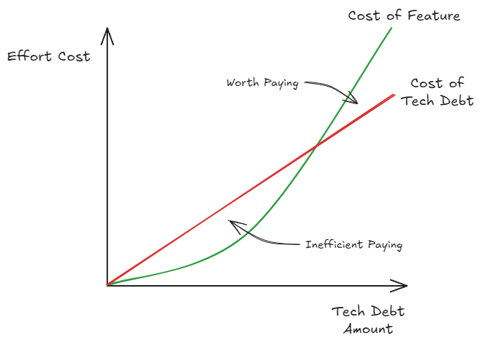
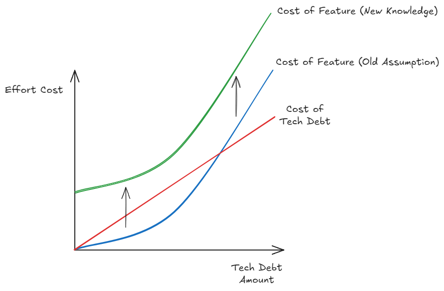

## Data at the Root

In short:

> "The data model is the hardest part change, so you want to make sure it's right. To get it right you need to know more about the domain or use case. To know more about the domain or use case you need to try things out. To try things out you need to implement and iterate a solution. To start building a solution you need a data model..."

At the heart of every project and every product is data. Data is what gives software value and meaning. Lets imagine you have constructed an infinitely horizontal scaling [microservice platform](https://microservices.io/), deployed smoothly with [blue-green deployment phases](https://docs.aws.amazon.com/whitepapers/latest/blue-green-deployments/welcome.html) and automated smoke testing. However, the data model underlying everything is just a single text file that each service must acquire a lock for before reading from and writing to. This entire solution is completely useless. It doesn't matter how sleek and optimised the service is, if the data is slow, it all falls over.

This might seem like an absurd example, because it is, but if you don't get the data modelling part right, it will feel similar. "Independent" microservices with poorly isolated data domains will need to constantly talk to one another. This creates strong coupling and a fragile microservice platform where any slight API or behaviour change will cause a failure that ripples across the services.

Once we have a data model, it is the hardest thing to change: DB migrations, data [ETL](https://en.wikipedia.org/wiki/Extract,_transform,_load) from legacy systems, data model constraint backwards compatibility. To be able to get it right, you need extensive knowledge of the domain and use cases. Often this knowledge requires years of experience in a particular domain to fully understand all of it. However, if you're working in a greenfield space or even just wanting to skill up in a new space, then we need a strategy to move forward without shooting ourselves in the foot for the future.

## Will I Need this?

Like all things, we want to evolve our data model in small iterations and validate it in the real world with live customers to ensure we have made the right decisions. Therefore, when you're making any change to a data model or its relationships don't try to "plan for the future". If you aren't using a data point or a relationship immediately when created, then it isn't needed and don't use it: [YAGNI](https://martinfowler.com/bliki/Yagni.html). If it isn't used, then it isn't being validated, and that is simply a liability. If you really need it, then it is guaranteed the next step in your iteration will just add it anyway, so why get ahead of yourself?

Saying *"never add something not in use"* can seem like a harsh line to draw. So as a caveat there are some legitimate times where adding a data point that isn't being used is acceptable. This is almost always occurs when the data point must exist from day zero for tracking or prosperity reasons. The most common example of this is when the data point is used for regulatory or reporting purposes. In these cases, there is almost always an internal (compliance) or external (regulator) domain expert involved that provide validation of this data point.

Finally, if you really are on the fence about adding something, just remember it is easier to add something than remove it. Adding is a "create" operation,  so by nature, there won't be any dependency or business logic hanging off the data point to begin with. On the other hand, removing risks introducing bugs or breaking changes in the current behaviour.

The other thing to consideration to make should be with a data constraint and integrity view. You want to ensure each data point is as strictly constrained as possible to ensure assumptions made about data points are codified in the data definition. It is always easier going from more constrained to less constrained. if the data point is introduced too early, before full utilisation, it will gather "legacy" values. Then when it is finally used and we begin validating, we will often find that there was a missing constraint! Uh-oh! We already have legacy values that need to be investigated and migrated when we never needed this headache.

## When to Migrate

Just because all your data points are being actively used, doesn't mean they're guaranteed to be right. As is the nature of the beast, there will always be changes and shifts from where we thought we needed to go, to where we now think we need to go. As such, migrating will be an inevitable part of almost every data models lifecycle. There is an art to knowing when to migrate, but it will almost always come down to a question of *"is this too painful to leave as it is now?"*.

From a business and customer perspective, data migration falls under the **tech debt** label. As such, to be able to make space in any road map, an evaluation of effort cost vs. feature efficiency gain must be made.

Paying tech debt early is always a wasted effort, as cost to pay it down at this point will always cost more than producing new features. Remember, the features are what actually provides value, not paying tech debt, to the business/customer. As tech debt accrues or time passes the cost to develop new features with the tech debt grows. However, so does the cost of paying the tech debt! The key difference is tech debt cost grows relatively linearly, while feature effort grows relatively exponentially. This means that at a certain point it goes from inefficient to paying off tech debt to worth paying off.

With data, there is one exception to this tech debt cost rule: *"Did we get a fundamental assumption incorrect in our data model?"*. If this is the case, we can't continue with our previous approach as we know the effort cost to develop features under the old assumption has now greatly increase. So we must begin to migrate immediately.

## Hindsight 20:20

The unfortunate [catch-22](https://en.wikipedia.org/wiki/Catch-22) is that if we had complete knowledge, we could correctly design our data model, however, to get complete knowledge we have to build our data model. There isn't really anything we can do about this. Therefore, we need to prepare ourselves for data model transformations and learn how to execute them successfully. So let's discuss a couple of common methods and their pros and cons.

### Migration In Situ

The most straight forward approach is to migrate the data in situ. This has the benefit of requiring the minimum amount of effort to transform from A to B, as everything is done where it lives. Usually, this would be done with a simple DB migration script, e.g. [Alembic](https://alembic.sqlalchemy.org/en/latest/) for Python SQL paradigms.

The primary downside for this method is the blast radius if something goes wrong is by far the highest, as you only have a single data store to work with in this case. As such, careful consideration will need to be given to backwards compatibility with existing functionality and any edge-cases which may occur as the result of this migration. As the distance between the A to B transformation increases, the complexity of the migration will increase, and so will the risk. Eventually, risk becomes far too high to tolerate and this approach becomes unsuitable, so we must look for something else.

### Net New Build

We've all had that feeling  of things getting too complex and think to ourselves *"if only I could re-build it all"*, so why not? With this approach, we can build a new data model in a new store with the knowledge we now have. Lift and shift from the original store to the new store is then commonly done with an [ETL](https://en.wikipedia.org/wiki/Extract,_transform,_load) approach.

The benefit here is that our existing data is left alone, so there is no risk to the original store. However, there is still a risk involved as we have to ensure once we move the consumers of data to the new store, all existing functionality is retained. As such, there can be a considerable design and testing effort to ensure the existing functionality will work after the switch over. Our ETL strategy will also need to be considered carefully, are we planning to do ETL once or regularly sync from the old to new store? A regular sync involves more total effort, but could help us validate the new store and reduce our risk of the switch over.

### Synced Shadow Mode

Here we build the new data model and implement a bi-directional data sync between old ↔ new. Then we can build new functionality or adapt existing functionality for our new store behind a feature flag, away from customers. This "shadow mode" allows us to fully develop the new world whilst ensure full functionality of the old world. The backwards sync also allows us to revert to the old model if anything goes wrong **after** we migrate. The downside is that significantly more effort is involved to sync from the new world to the old. Often we need to make extraneous infrastructure to support the sync, and there will need to be concessions on how the data will be ported backwards.

Whilst the most involved method, the sheer fact that we can road test our new data model with no impact to the existing data makes this my preferred approach for anything other than adding/renaming data points or simple constraints changes. Reducing the risk of breaking anything existing whilst allowing us to build confidence in our new model makes it the obvious choice for me.

## The Wrap

Given how critical data is to the value of our software, it is important to give it the attention it demands. Strike the fine balance between careful consideration of your data model. Accept that it will never be perfect to begin with, and use velocity to validate the assumptions you've made. When things eventually go wrong, understand how to achieve transformations to course correct. Constantly evaluate where you are on the tech debt vs. effort cost curves and ensure the right balance for you is achieved.
