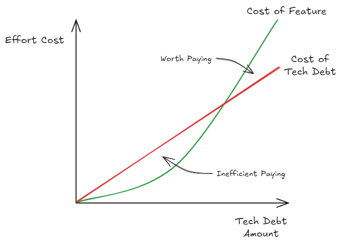
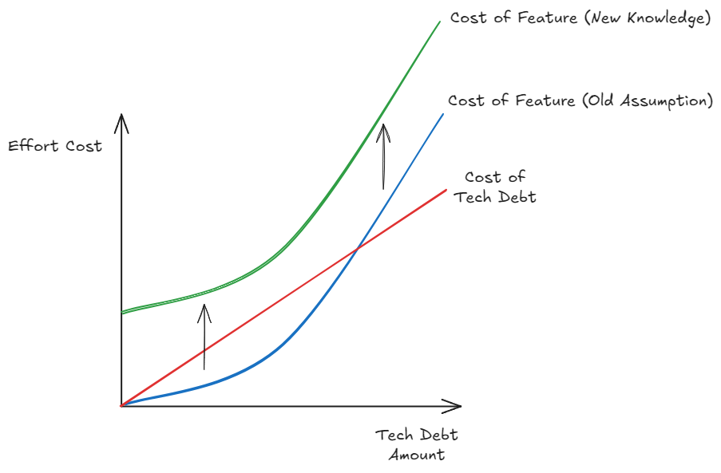

## Data at the Root

At the heart of every project and every product is data. Data is what gives value and meaning to a piece of software. Lets imagine you have constructed an infinitely horizontal scaling [microservice platform](https://microservices.io/), deployed smoothly with [blue-green deployment phases](https://docs.aws.amazon.com/whitepapers/latest/blue-green-deployments/welcome.html) and automated smoke testing. However, the data model underlying everything is just a single text file that each service must acquire a lock for before reading from and writing to. This entire thing is now completely useless. It doesn't matter how sleek and optimised the service is, if the data is slow, it all falls over.

This might seem like an absurd example, because it is, but if you don't get the data modelling part right, it will feel similar. "Independent" microservices with poorly isolated data domains will need to constantly talk to one another. This creates strong coupling and a fragile microservice platform where any slight API or behaviour change will cause a failure that ripples across the services.

Getting the data model right should be the most critical part of any project or product, this is compounded by the fact that it is also the hardest part to change: DB migrations, data [ETL](https://en.wikipedia.org/wiki/Extract,_transform,_load) from legacy systems, data model constraint backwards compatibility. To be able to get it right, you need extensive knowledge of the domain and use cases. Often this knowledge requires years of experience in a particular domain to fully understand all of it. However, if you're working in a greenfield space or even just wanting to skill up in a new space, then we need a strategy to progress without shooting ourselves in the foot for the future.

## Will I Need this?

Like all things, evolving our data model in small iterations and validating what we've done in the real world with real life customers is going to give us the best results. Therefore, when you're making any change to a data model or its relationships don't try to "plan for the future". If you aren't using a data point or a relationship immediately when created, then it isn't needed and don't use it, [YAGNI](https://martinfowler.com/bliki/Yagni.html). If you're not using something, it isn't being validated in production and that is simply a liability. If you really need it, then it is guaranteed the next step in your iteration will just add it anyway.

Saying never adding something else it is used can seem like a harsh line to draw. So as a caveat there are some legitimate, edge cases, where adding a data point that isn't being used is acceptable. This is often when the data point must exist from day zero for tracking or prosperity reasons. The most common example of this is when the data point is used for regulatory or reporting purposes. In these cases, there is almost always an internal or external domain expert involved that provide validation of this data point.

Finally, if you really are on the fence about adding something, just remember it is easier to add something than remove it. Adding is a "create" operation which by nature means there is no dependency or business logic hanging off the data point. Whilst removing more easily introduces bugs or breaking changes in the current behaviour. The other thing to consider is looking at the data constraint and integrity view, you want to ensure each data point is as strictly constrained as possible. It is always easier going from more constrained to less constrained. If you make the data point too early, before it is fully utilised, it will gather "legacy" values. Then when it is finally used and validated in product, we will often find that there was a missing constraint! Uh-oh! We already have legacy values that need to be investigated and migrated when we never needed this headache.

## When to Migrate

Just because all your data points are being actively used, doesn't mean they're guaranteed to be right. As is the nature of the beast, there will always be changes and shifts from where we thought we needed to go, to where we now think we need to go. As such, migrating will be an inevitable part of almost every data models life. There is an art to knowing when to migrate, but it will almost always come down to a question of "is this too painful to leave as it is now?".

From a business and customer perspective, data migration falls under the *tech debt* label. As such, to be able to make space in any road map to migrate will require an evaluation of effort vs. efficiency gain.

Paying tech debt early is always a wasted effort, as cost to pay it down at this point will always cost more than producing new features. Remember, the features are what actually provides value, not paying tech debt, to the business/customer. As tech debt accrues or time passes, the cost to pay off the tech debt and to develop new features grows. The key difference is tech debt cost grows relatively linearly, while feature effort grows relatively exponentially. This means that at a certain point it goes from inefficient to paying off tech debt to worth paying off.

With data, there is one exception to this tech debt rule of change: "Did we get a fundamental assumption incorrect in our data model?". If this is the case, we can't continue with our previous approach as we know the entire effort to develop features under the old assumption has increase. So we must begin to migrate immediately.

## Hindsight 20:20

The unfortunate [catch-22](https://en.wikipedia.org/wiki/Catch-22) is that if we had complete knowledge, we could correctly design our data model, however, to get complete knowledge we have to build our data model. So there isn't anything we can do, therefore we need to know how we can execute these transformations successfully. So let's discuss a couple of common methods and their pros and cons.

### Migration In Situ

The most straight forward approach is to migrate the data in situ. This has the benefit of having the minimum amount of effort to from from A to B, as everything is done where it lives. Usually, this would be done with a simple DB migration script, e.g. [Alembic](https://alembic.sqlalchemy.org/en/latest/) for Python SQL paradigms.

The primary downside for this method is the blast radius for if something goes wrong is by far the highest, as you only have 1 instance of your data with this approach. As such, careful consideration will need to be given to backwards compatibility with existing functionality and any edge-cases which may occur as the result of this migration. As the distance between the A to B transformation increases, the complexity of the migration will increase, and so to will the risk. Eventually, this approach becomes unsuitable and we must look for something else.

### Net New Build

Often we feel that things get complex and wish "if only I could re-build it all", so why not? With this approach, we can build a new data model in a new place with the knowledge we now have. To lift and transform the data from the original store to the new store an ETL approach is most commonly used.

The benefit here is that our existing data is left alone, so there is no risk to the store. However, there is still a risk involved as we have to ensure once we move our consumers of the data to the new store, all our existing functionality is retained. As such, there can be a considerable effort to ensure the existing functionality will work on the new data once we switch over. Our ETL strategy will also need to be considered carefully, are we planning to do ETL once or regularly sync from the old to new store. A regular sync involves more effort, but could help reduce our risk once we do switch over.

### Synced Shadow Mode

Here we build the new data model and implement a bi-directional data sync between old<>new. Then we can build new or adapt existing functionality on top of our new store, behind a feature flag away from customers. This "shadow mode" allows us to fully develop the new world whilst ensure full functionality of the old world. The downside is there is significantly more effort involved in syncing from the new world to the old, as we often need to make extraneous infrastructure to sync them, as well as concessions on how the data can be ported backwards.

Whilst the most involved method, the sheer fact that we can road test our new data model with no impact to the existing data makes this my preferred approach for anything other than adding/renaming data points or simple constraints. Reducing the risk of breaking anything existing whilst allowing us to build confidence in our new model is makes it the obvious choice.

<!-- TODO: end comment -->

*Notes:*
Data model paradox
0\. Intro - Data model is the hardest to change, so you want to make sure it's right. To get it right you need to know more about the domain or use case. The know more about the domain or use case you need to try things out. The try things out you need to iterate and improve a solution. To start building a solution you need a data model...

1. Will I needs this? - don't add things because you think you'll need it in the future. Adding easy, removing harder
2. When to migrate - how to know when things need to change a bit
3. Hindsight 20:20 - when to rebuild the model entirely and transform (duplication "shadow mode")
