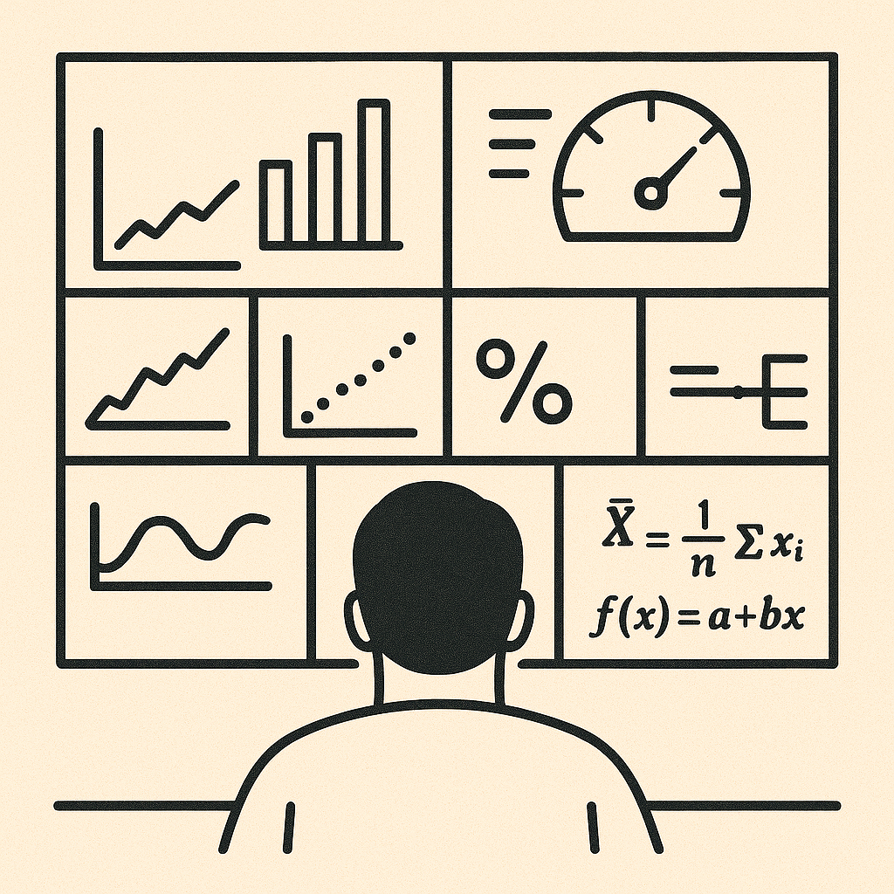
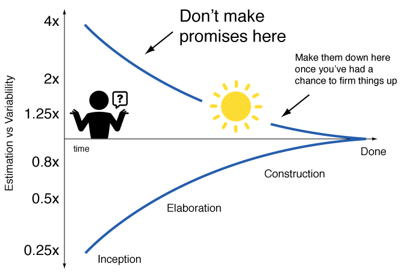

## Estimation of Meaning

Why bother spending the time to estimate anything? Why not just spend the time working on the problem? As engineers, the primary purpose for making estimates is for reasoning and prioritisation. We can leverage estimation to determine magnitudes of load for a system and predict there are valid performance concerns or not for a given solution.

Estimation isn't just guessing, there is a skill to being able to take incomplete information and fill in the gaps with approximations to make decisions. Let's take the simple example of estimating how long a unit of work will take to complete. The only time we can know with 100% certainty how long it will take us to complete is once the work has finished. Obviously, this is far too late to determine if we should do the work or not, since it is already done! However, if we know nothing about what is required, our estimate is likely to be widely off, so not very useful. This is known in project management as the *"cone of uncertainty*".

This is where skill and experience come in. We want to be able to make an estimate with enough confidence to made a decision to unblock our work using the least information possible.

So let's dive into how estimations are done and when we should be applying them.

## Estimation of Maths

You may think mathematicians would never estimate a value, and that is true, but they will determine "bounds" to problems. The most common example of these bounds are used when trying to determine a proof for a conjecture. One example that is easier to comprehend is for the [Collatz Conjecture](https://en.wikipedia.org/wiki/Collatz_conjecture). This conjecture uses a given function:

$$
f(n) = \begin{cases}
n/2 & \text{if n is even} \\
3n + 1 & \text{if n is odd}
\end{cases}
$$

The conjecture states that any positive integer which is input to the equation and subsequent results re-input will always eventually converge to a value of 1 after enough recursive inputs. When trying out some numbers ourselves, you may have a strong sense that the conjecture is true. However, since this is maths we need proof, and it simply doesn't exist. At best, we know that from the numbers between $\lbrack1,x\rbrack$ that only $x^{0.84}$ of them do converge, but this is not 100%!

Outside of maths, in the real world as engineers, we don't need exactness to act. The real world often has many tiny variables which do impact us, however, since they are tiny we can effectively ignore them. A simple example of this is estimating pendulum motion using the [small-angle approximation](https://en.wikipedia.org/wiki/Small-angle_approximation): $\sin(\theta) \approx \theta$. This only holds true for small values of $\theta$, which commonly for a swinging pendulum, is always true. As such, we can simplify all the work we need to do to know the [position of the pendulum](https://en.wikipedia.org/wiki/Pendulum_\(mechanics\)#Small-angle_approximation) to entirely ignore the transient angle of the pendulum away from the vertical:

$$ \frac{d^2\theta}{dt^2} = -\frac{g}{L}\sin\theta \approx -\frac{g}{L}\theta$$

And therefore the frequency and period:

$$\omega = \sqrt{\frac{g}{L}}, \quad T=2\pi\sqrt{\frac{L}{g}}$$

The key take-away here isn't the maths, but the idea of comparing the magnitude of variables with each other and simplifying by removing variables of a significantly smaller relative magnitude.

## Estimation of Decision

When approaching any problem, it is critical you an correctly identify the right areas to prioritise your focus on first. As engineer's we often want to do everything and address all problems to make it perfect. However, we have finite time in life, so we must selectively apply our time for what matters. So let's go through a concrete example where estimation skills can correctly guide you through a system design problem. Let's say you are designing a *"top 5 current most played"* feature for a music streaming app (think Spotify). We are given this starting metric:

> 10 million active users at any time, interacting with the app

To begin with, we know we will need an API service to provide the most played list, and this list will need to be updated to know what users are currently listening to. So let's start estimating! We can start making a foundational assumptions that each song has an average length of 3 min. From this we know that users will likely only interact with an app every 3 min, so the list API will need:

$$10,000,000 / 180s \approx 56,000\ req/s$$

Additionally, if we need to know a song start and end event then for each song we have:

$$10,000,000 / 180s \times 2 \approx 112,000\ events/s$$

We could consider that users won't always listen through a whole song, some might end early, some might skip, some songs are longer, etc. But remember, we want magnitudes here. Even if 5% of users won't listen fully to a song (which is an overestimate estimate for this case) we are effectively saying the *"average"* song length becomes 2.5% less on average. It is 2.5% since we average time at which users would skip would just be half the song (assuming [uniform distribution](https://en.wikipedia.org/wiki/Continuous_uniform_distribution) **or** [normal distribution](https://en.wikipedia.org/wiki/Normal_distribution)). Therefore the total *"average"* even time becomes 2 min 56 seconds, which doesn't meaningfully impact our above metrics anyway, so we will just simplify.

Given the above magnitudes of processing along with the fact that events would require a *"write"* operation and API requests a *"read"* operation, the event handling should definitely be the primary concern! In this example, we used estimates to get some quantitative data points to determine a priority. The data points aren't concrete, but the difference in the magnitudes of them is sufficient to give us the guidance we desired.

## Estimation of Timing

Another pitfall which we often fall into is to blow a performance concern out of proportion. In our algorithms and data structure classes, we were always taught to prioritise on performance, telling us we must learn [big O](https://en.wikipedia.org/wiki/Big_O_notation) time and space complexities for various solutions. However, the real world isn't always about your code being blazing fast, we aren't all trying to manage millions of concurrent users, thousands of terabytes of data processing, or working on time-critical, low latency systems. Some of us build complex systems where readability and maintainability are actually more critical, where our largest inefficiencies aren't un-optimised loops, but system comprehension and reasoning. In these cases, estimation is your friend to help you make the right trade-off.

Let's take an example of a payment system that keeps contains multiple recipients and all the payments made to them. We want to provide a way to present how many times each recipient has been paid and how recently, for customer's to understand their usage. For our data, we keep a list of all recipients and a list of all payments. So if we want to have a read operation of the all the recipient stats, we would need to loop over each recipient ($R$) and then each payment ($P$) to determine them, which would have $O(R \times P)$ time complexity.

A read operation of $O(R \times P)$ isn't very fast, so let's find a solution to speed up the process. One option is to use de-normalised data for the stats on each recipient, therefore making the read operation $O(R)$. These de-normalised stats would need to be updated on the recipient each time a payment occurs, which would involve either a subsequent asynchronous recipient update after the payment or a synchronous update to the recipient when the payment occurs. In these cases, we need to consider trade-offs of weak read consistency of the asynchronous updates or weaker resiliency with dual-write concerns for synchronous updates. Both cases also would need to consider concurrency of the operations in a scaled system with higher throughput.

In the above case, there is a lot of complexity to have a more performant system, but we never stopped to consider *"did we need performance"*? Well let's go back and do some estimation of if the performance is a problem. We can leverage some additional information we may know about our users behaviour to improve the estimation accuracy to understand our performance concerns. Let's say our system above is used primarily by [small to medium enterprises](https://single-market-economy.ec.europa.eu/smes/sme-fundamentals/sme-definition_en), a very large market. In this case, unless they're e-commerce businesses, we would expect to see a few recipients with many payments. Using a equivalency logic, like pendulum motion, if $R$ is significantly less than $P$, we could say:

$$O(R \times P) \approx O(P) \quad \text{ if } R << P$$

For an e-commerce business, where the opposite is usually true, many recipients with few payments, then we could say:

$$O(R \times P) \approx O(R) \quad \text{ if } P << R$$

In these cases, our performance optimisation becomes only a minor improvement. This highlights the necessity to understand *"heuristic user behaviour"* and making quantitative estimates to determine if something, that can feel like a major performance bottleneck, really is or not.

## Estimation of Change

It is critical to keep in mind that no matter how good we get at estimation, it is still an estimation, it isn't infallible. Therefore, it is equally important to know: *"When is the right time to change paths?"*. A wrong decision is always an inevitability, so don't get blinded by our previous choices and always feel empowered to re-evaluate and do what makes sense. You also don't have to wait until the pain occurs, you can always estimate **when** it will become an issue too!
