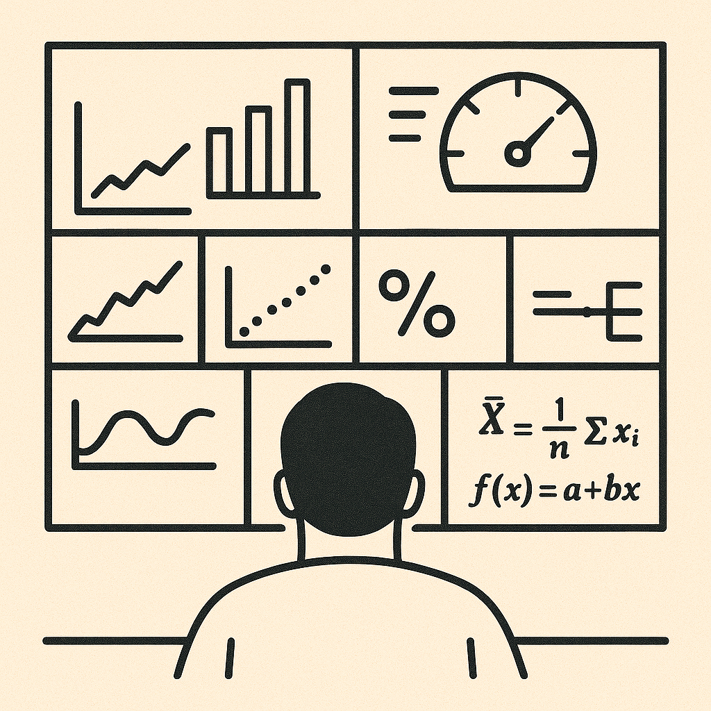
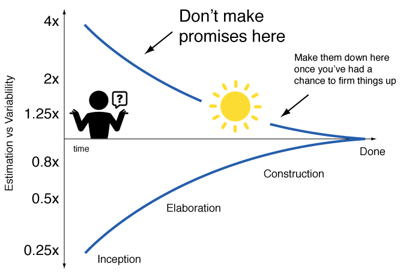

## Estimation of Meaning

Why bother spending the time to estimate anything? Why not just spend the effort working on the problem? As engineers, the primary purpose for making estimates is to help us reason and prioritise. It also allows us to determine quantitative magnitudes of performance metrics to predict if performance concerns are valid or not for a solution.

Estimation isn't just guessing, there is a skill to being able to take incomplete information and make decision. Let's take the simple example of estimating how long a unit of work will take to complete. The only time we can know with 100% certainty how long it will take us to complete is once the work has finished. Obviously, this is far too late to determine if we should do the work or not, since it is already done! However, if we know nothing about what is required, our estimate is likely to be widely off. This is known in project management as the *"cone of uncertainty*".

This is where skill and experience come in. We want to be able to make the most reasonable estimate that unblocks our ability to decide, using the least information possible.

So let's dive into how estimations are done and when we should be applying them.

## Estimation of Maths

You may think mathematicians would never estimate a value, and that is true, but they will determine "bounds" to problems. The most common example of these bounds are used when trying to determine a proof for a conjecture. One example that is easier to comprehend is for the [Collatz Conjecture](https://en.wikipedia.org/wiki/Collatz_conjecture). This conjecture uses a given function:

$$
f(n) = \begin{cases}
n/2 & \text{if n is even} \\
3n + 1 & \text{if n is odd}
\end{cases}
$$

The conjecture states that any positive integer which is input to the equation and subsequent results re-input will always converge to a value of 1 after enough recursive inputs. When doing testing with some random numbers you choose, you may have the feeling that this is true. However, since this is maths we need proof, and it simply doesn't exist. At best, we know that from the numbers between $\lbrack1,x\rbrack$ that only $x^{0.84}$ of them do converge.

For the rest of use who live in the real world, especially engineers, we don't need exactness to act. The real world often has many tiny variables which do impact us, however, since they are tiny we can effectively ignore them. A simple example of this is the [small-angle approximation](https://en.wikipedia.org/wiki/Small-angle_approximation): $\sin(\theta) \approx \theta$. This only holds true for small values of $\theta$, which for determining the motion of a pendulum is always true. As such, we can simplify all the work we need to do to know the period of the pendulum swing to entirely ignore the transient angle of the pendulum to away from the vertical.

The key take-away here isn't the maths, but the idea of comparing the magnitude of variables with each other and simplifying by removing variables of a significantly smaller relative magnitude.

## Estimation of Decision

When approaching any problem, it is critical you an correctly identify the right area to focus on in first and prioritise. As engineer's we often want to do everything and address all problems to make it perfect. However, we have finite time in life, so we must selectively apply our time. So let's go through a concrete example where estimation skills can correctly guide you through a system design problem. Let's say you are designing a *"top 5 current most played"* feature for a music streaming app (think Spotify). We are given this starting metric:

* 10 million active users at any time, interacting with the app

To begin with, know we will need an API service that provides the list from the backend and a way to know what users are listening to what songs. So let's start estimating! We can start with a foundational rough estimate that each song is an average length of 3 min. From this we know that users will likely only interact with an app every 3 min, so the list API will need:

$$10,000,000 / 180s \approx 56,000\ req/s$$

Additionally, if we need to know a song start and end event then for each song we have:

$$10,000,000 / 180s \times 2 \approx 112,000\ events/s$$

Given events need to result in a data *"write"* operation and API request a *"read"* operation, the event handling should definitely be the primary concern! In this example, we used estimates to take a step back and use quantitative data points to determine a priority. The data points aren't concrete, but the difference in magnitudes of them is sufficient to give us the guidance we desired.

## Estimation of Timing

Another pitfall which we often fall into is to blow a problem out of proportion. In our algorithms and data structure classes, we were always taught to prioritise on performance and learn [big O](https://en.wikipedia.org/wiki/Big_O_notation) time and space complexities for various things. However, the real world isn't always about your code being blazing fast, we aren't all trying to manage millions of users, thousands of terabytes of data or working on low latency systems. Some of us build complex systems where readability and maintainability are actually more critical where our largest inefficiencies aren't un-optimised loops, but system understanding and comprehension. In these cases, estimation is your friend to help you make the right trade-off.

Let's take an example of a payment system that keeps contains multiple payees and all the payments made to them. We want to provide insights for our customer's to know how many times each payee has been paid and how recently. For our data, we keep a list of all payees and a list of all all payments. So if we want to show these stats for each payee, we would need to loop over each payee and then each payment to determine them, which would have O(n\*m) time complexity. So one option to improve performance is to use de-normalised data for the stats on each payee. These de-normalised stats would need to updated on the payee each time a payment occurs, which would involve either subsequent asynchronous payee updates after a payment or synchronous updates to payee when a payment occurs. In these cases, we need to consider trade-offs of weak read consistency with asynchronous updates or weaker resiliency with dual-write concerns for synchronous updates. Both cases also would need to consider concurrency of the operations in a scaled system with move throughput.

<!-- TODO: Heuristic user behaviour -->

In the above case, there is a lot of complexity to have a more performant system, but we never stopped to consider "did we need performance"? Well let's go back and do some estimation of our problem. If we know some additional information about the behaviour of our users

## Estimation of Change

It is critical to keep in mind that no matter how good we get at estimation, it is still an estimation, it isn't infallible. Therefore, it is equally important to know: *"When is the right time to change paths?"*. A wrong decision is always an inevitability, so don't get blinded by our previous choices and always feel empowered to re-evaluate and do what makes sense.

*Notes:*

0. Finger in the air maths, cone of uncertainty
1. Rough equivalence (sin-theta = 1 for low angles)
2. Common incorrect choice due to bad estimation, performance vs. readability
3. Not just how to estimate but when to estimate. When weighing up a problem, recency bias or personal feelings easily cloud judgement of how important something it to work on. Stepping back and doing estimates helps create quantitative data points to help decide. > Heuristic behaviour patterns of users
4. Estimation of timing - estimating how long processes or things will take to determine magnitude of acceptable processing time vs. solving the performance bottleneck
