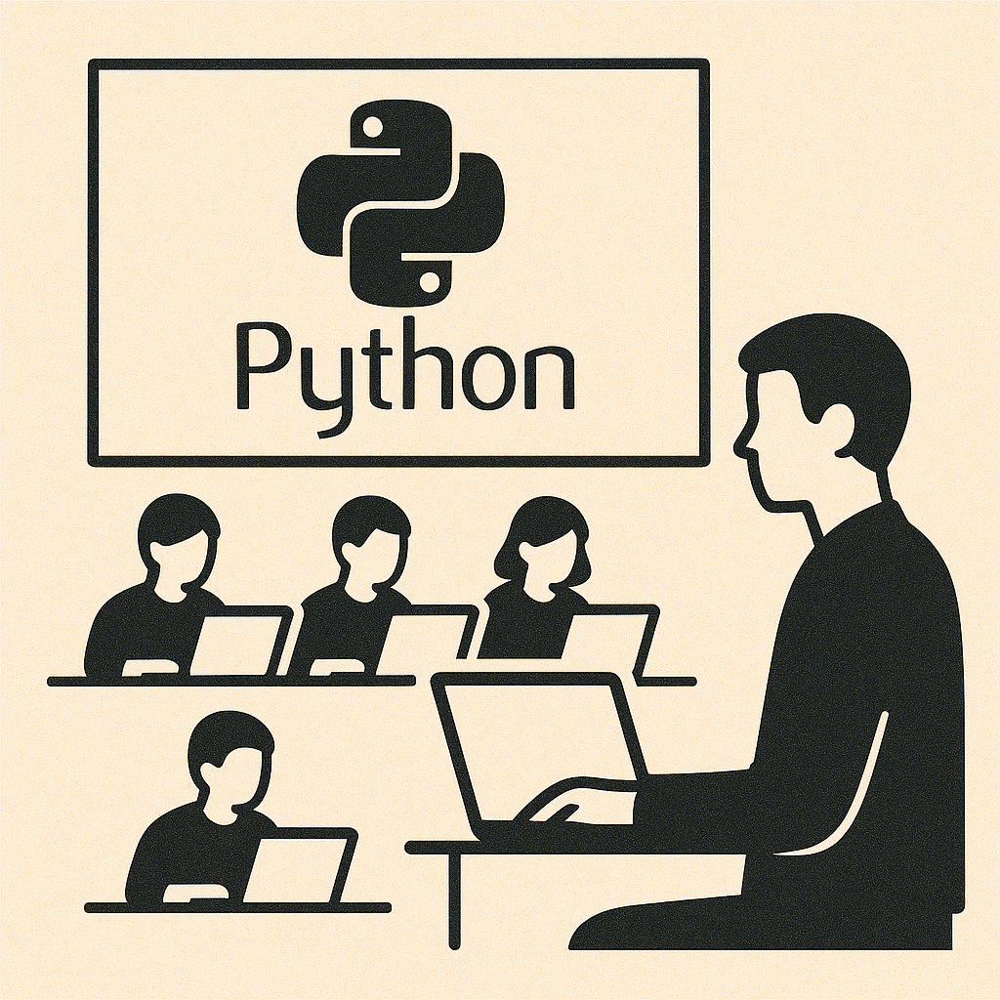

## Moving Quick in Ambiguity

When working in a [greenfield](https://en.wikipedia.org/wiki/Greenfield_project) space, we are always working within an area of ambiguity. Here, we always want to move at pace to allows quickly finding a [product market fit](https://www.productplan.com/glossary/product-market-fit/). Given this goal, it might be tempting to reach for a dynamically typed language which allows you to develop quickly. Python is a popular choice for this given the ability to write [pseudocode](https://en.wikipedia.org/wiki/Pseudocode) in a file, add the `.py` extension and run code! This idea even led to a very funny Python lib called [stackoverflow](https://pypi.org/project/stackoverflow/) which lets you import a string which would then be a search term to find a top rated comment from Stackoverflow and execute it. This paired with Python being the most common introduction language, used throughout bootcamps globally, ensures there is a large pool of Python developers out there. However, whilst in the short term it may seem beneficial, I amd going to argue the long term pain of a dynamically typed language far outweighs the initial development speed benefit.



## Type Help!

As a system grows in both size and age, having deterministic behaviour of the program becomes critical for system comprehension and the resiliency. [Hyrum's Law](https://www.hyrumslaw.com/) states that given sufficient amount of consumers of a system, every observable behaviour of that system will be depended upon. Before being depended upon, every behaviour would first need to occur, meaning eventually **every** behaviour will occur. This means that if your system ever has [undefined behaviour](https://en.wikipedia.org/wiki/Undefined_behavior), then critical flaws/bugs/exploits become extremely likely to manifest. This is where typing becomes your best friend!

Typing provides clear bounds and guard rails for your system with the structure of the data which is expected. Not only this, but the type checking will occur statically before any code is even run! This avoids additional validation overhead at runtime as the data passes throughout the system, leaving only validation of input data at the interface of the system. These days mature dynamic languages, like Python, do come with optional static type checkers you can use and integrate to a build pipeline. However, since typing isn't a first class citizen in a dynamic languages design the effectiveness of these checkers can be questionable at times. In the past, I've seen the [mypy](https://github.com/python/mypy) Python type checker fail me multiple times, causing production incidents with customer impact. A simple example of these issues can be seen when using a common Python library, [SQLAlchemy](https://www.sqlalchemy.org/). We can define an ORM schema for a model with fields as such:

```python
class People(Base):
  __tablename__ = "people"

  id: Mapped[int] = mapped_column(primary_key=True)
  first_name: Mapped[str] = mapped_column(String(30), nullable=False)
  middle_name: Mapped[str] = mapped_column(String(30), nullable=True)
  last_name: Mapped[str] = mapped_column(String(30), nullable=False)
```

In this example, our DB model `People` has a `middle_name` field defined as `nullable=True` so will be optional, i.e. of type `str | None`. However, in our code `mypy` will consider `middle_name` as type `str` instead due to the `Mapped[str]` typing, so we can easily get undefined behaviour when `middle_name` is `None`. `mypy` provides no warning that `middle_name` could be `None` and happily lets us use the type as a full `str`. While you could say this is just a developer error, that is the entire point of type checking, to avoid these errors which can easily occur in larger code bases.

It's not just the type checker that can fail us here. Given we're in the dynamically typed world, most checkers also allow `Any` typing, meaning we can just skip any real bounds checking and go immediately back to square one. In software, it is always best to avoid systems of trust in place of systems of guarantees. Don't trust other contributors to do the right thing, and more importantly, don't trust yourself either!

## Aged Like Fine Milk

So what should be done instead? Whilst there is a benefit to dynamically typed languages for initial rapid ideation and prototyping, eventually we need to transform to a matured stable system. This is the crux of the problem, transformation is always hard **and** needing to shift to a matured system happens quicker than you may think or plan for. Once you feel the pain of maintaining a legacy dynamically typed system you will always end up saying "I should have just used a strongly typed language at the start". There is a comparable analogy that can be seen for manufacturing. Large scale production using specialised manufacturing machines reduces the per unit cost at the cost of larger initial investment, while more readily available general purpose machines which have no initial cost can be used but result in a higher per unit cost. For plastic components, this is commonly comparing injection moulding requiring purpose built tooling to general purpose 3D printing.


This isn't to say dynamically typed languages don't have their place. If you are creating tooling, scripts or anything you don't need to maintain at a production quality, then it is absolutely a good choice! Similar to the above use case of 3D printing, it can also be used for rapid prototyping (i.e. proof of concepts) before committing to building the final product in a more durable material (i.e. strongly typed language).

## Language Cohesion

So what is a good strongly typed language to choose? Naturally, different languages and their supporting frameworks have their own pros and cons, and with many languages/frameworks also comes a huge variety of features. Therefore there can be a wide variety of viable options, however, just because a feature exists doesn't mean it is fit for purpose. As a result many language/framework pairs have an *"ideal"* use cases for which they can be used. In a perfect world, we would just choose the best language/framework for what we're doing, but the number of use cases we'll come across in our product will increase quicker than the number of engineers whom will build the product. As such, we can't possibly support using a new language/framework for each use case we come across, even if it is an ideal fit. The effort and required knowledge to build/maintain all these languages/frameworks will cost significantly more than a sub-optimal language use case application.

In some cases, we can't avoid needing multiple languages in the cases we're limited by external factors in the space we're working. For example, if we creating the client-side frontend for a web application, we're often limited to the [JavaScript](https://developer.mozilla.org/en-US/docs/Web/JavaScript)/[TypeScript](https://www.typescriptlang.org/) ecosystem and its 100s of available frameworks. On the backend, by choosing JavaScript/TypeScript with [Node.js](https://nodejs.org/en) we can have perfect language cohesion with types shareable between frontend and backend applications. However, it can be common to have performance or ecosystem (toolchains, libraries, etc.) concerns when selecting Node.js for your backend services. In these cases, we still can leverage strong type checking methodology across our entire system by leveraging technologies like [Protocol Buffers](https://protobuf.dev/) or [Pact](https://pact.io/). As such 9 times out of 10 it's best to just choose a general purpose language with an extensive ecosystem and plenty of available engineers. For popular strongly typed languages we are left with choices like Typescript with React for the frontend and Java/Kotlin/Go/Typescript for backend services.

## ~~After~~ Before All

Strong static type checking should be seen as one of the core tenants of *"shift left"*, it should be considered as critical as tests are for ensuring program correctness. Some languages even take the concept of static checking further. In C++, the [`static_assert`](https://en.cppreference.com/w/cpp/language/static_assert.html) declaration exists to force the compiler to do static checks at compile time to shift the validation away from the runtime entirely. While this is likely an extreme approach for most needs, the idea of shifting when checks and validations are done can be clearly applied everywhere. In the testing world, we strive for the [practical test pyramid](https://martinfowler.com/articles/practical-test-pyramid.html) prioritising lower level unit tests over integration and end-to-end tests as they are easier to write and cheaper to run. This should be the same way you think of a strong type system, it allows you to replace more abstract complex validations with lower level checks!


