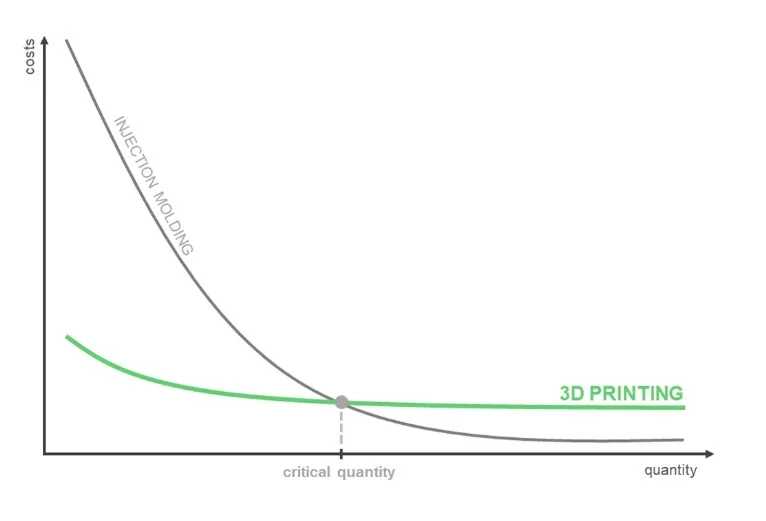

## Moving Quick in Ambiguity

When working on a [greenfield](https://en.wikipedia.org/wiki/Greenfield_project) project, we are always working within an area of ambiguity. Within this space, we always want to move at pace to ensure we can quickly find [product market fit](https://www.productplan.com/glossary/product-market-fit/). Given this goal, it might be tempting to reach for a dynamically typed language which allows you to develop quickly. Python is a popular choice for this given the ability to write [pseudocode](https://en.wikipedia.org/wiki/Pseudocode) in a file, add `.py` extension and run code! This even lead to a very funny Python lib called [stackoverflow](https://pypi.org/project/stackoverflow/) which would literally copy-paste top rated code from Stackoverflow. This paired with Python being the most common introduction language, used throughout bootcamps globally also ensures there is a large pool of Python developers out there. However, whilst in the short term it may seem beneficial, I would argue the long term pain of a dynamically typed language far outweighs the initial speed benefit.


## Type Help!

As a system grows in both size and age, having deterministic behaviour of the program becomes critical for the understanding of the system and the resiliency. [Hyrum's Law](https://www.hyrumslaw.com/) states that given sufficient amount of consumers of a system, every observable behaviour of the system will be depended upon. However, before being depended upon, every behaviour would first occur. This means that if your system ever reaches [undefined behaviour](https://en.wikipedia.org/wiki/Undefined_behavior), then critical flaws become extremely likely to manifest. This is where typing becomes your best friend!

Typing provides clear conditions and bounds for your system in terms of the structure of the data which is expected. Not only this, but the type checking should occur statically before the program is even run. This avoids additional validation at runtime as the data passes throughout the system, with the only required runtime validation at the edges of the systems. These days mature dynamic languages, like Python, do come with optional static type checkers you can use and integrate to a CI pipeline. However, since typing isn't a first class citizen in a dynamic languages design the effectiveness of these checkers can be questionable at times. In the past, I've seen the [mypy](https://github.com/python/mypy) Python type checker fail me multiple times, causing production incidents. A simple example of where the static type checker is with using a common Python library, [SQLAlchemy](https://www.sqlalchemy.org/). We can define an ORM schema for a model with fields as such:

```python
class MyDbModel(Base):
  __tablename__ = "mr_tables"

  id: Mapped[int] = mapped_column(primary_key=True)
  data: Mapped[str] = mapped_column(String(10), nullable=True)
```

In this example, our DB model `MyDbModel` has `data` field defined as `nullable=True` so will be optional, i.e. of type `str | None`. In our code `mypy` will consider `data` as type `str` instead due to the `Mapped[str]` typing, so we can easily get undefined behaviour when `data` is `None`. While this is arguably a developer error, there is no warning from `mypy` about this and is easily done in larger code bases.

It's not just the type checker that can fail us here. Given we're in the dynamically typed world, most checkers also allow `Any` typing, meaning we can just skip any bound defining and go immediately back to square one. In software, it is always best to avoid systems of trust in place of those that guarantee things. Don't trust other contributors to do the right thing, and more importantly, don't trust yourself either!

## Aged Like Fine Milk

So what should be done instead? Whilst there is a benefit to dynamically typed languages for the initial rapid ideation and prototyping stages, eventually we need to transform to a matured stable system. This is the crux of the problem, transformation is always hard **and** need to shift to a matured system happens quicker than you may think. By the time you get to the pain of maintaining a legacy dynamically typed language you will always end up saying "I should have just used a strongly typed language". There is a comparable analogy that can be seen in manufacturing, where you can spend a larger initial cost for specialised manufacturing machines that then reduce the overall per unit cost, or use readily available machines which have no initial cost but a higher per unit cost.



This isn't to say dynamically typed languages don't have their place. If you are creating tooling, scripts or anything you don't need to maintain at a production quality, then it is absolutely a good choice! In the vein of the analogy above, it can be used in the same was as 3D printing for rapid prototyping before committing to building the final product in a more durable material.

## Language Cohesion

So what is a good strongly typed language to choose? Naturally, different languages and their frameworks have their own pros and cons, with many languages/frameworks also coming with a huge variety of features. This gives you a wide variety of viable options, however, just because a feature exists doesn't mean it is fit for purpose. As a result many language/framework pairs have *"ideal"* use cases which must be understood. In a perfect world, we would just choose the best language/framework for what we're doing, but the number of use cases we'll come across in our product will increase quicker than the number of engineers which must maintain the product. This means we can't possibly support every new language/framework for each use case we come across, even if it is an ideal fit. For each new language/framework that is introduced the effort and required knowledge to build/maintain it will be significantly more costly than a sub-optimal language use case application.

In some cases, we can't avoid needing multiple languages if we're limited by language support in the space we're working. For example, if we are using client-side web rendering, we're often limited to the [JavaScript](https://developer.mozilla.org/en-US/docs/Web/JavaScript)/[TypeScript](https://www.typescriptlang.org/) ecosystem and its 100s of available frameworks. On the backend, by choosing JavaScript/TypeScript with [Node.js](https://nodejs.org/en) we can have perfect language cohesion with types shareable between frontend and backend applications. However, it can be common to have performance or ecosystem concerns with selecting Node.js for your backend services. In these cases, we still can leverage strong type checking methodology across our entire system by leveraging technologies like [Protocol Buffers](https://protobuf.dev/) or [Pact](https://pact.io/).

## ~~After~~ Before All

Strong static type checking should be seen as one of the core tenants of *"shift left"*, it should be considered as critical as our tests for ensuring program correctness. Some languages take the concept of static type checking, and other static checks, further. In C++, the [`static_assert`](https://en.cppreference.com/w/cpp/language/static_assert.html) declaration exists to force the compiler to do static checks at compile time to shift the validation away from the runtime entirely. While this is likely an extreme approach for most needs, the idea of shifting when checks and validations are done can be clearly applied elsewhere. In the testing world, it is always easier and quicker to test at the unit test level where end-to-end tests are harder to write and more costly to run. This should be the same way you think of a strong type system, it allows you to replace more abstract complex testing with lower level checks!


