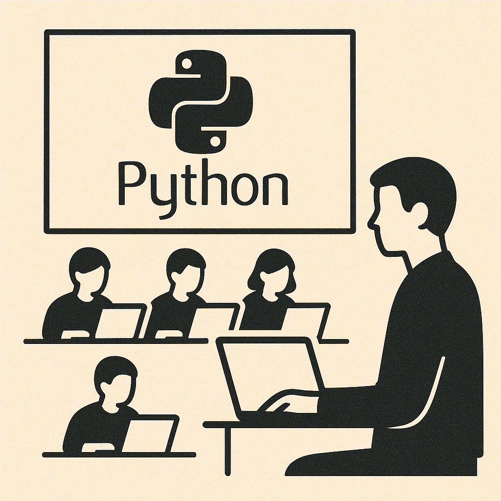

## Moving Quick in Ambiguity

When working on a [greenfield](https://en.wikipedia.org/wiki/Greenfield_project) project, we are always working within an area of ambiguity. Within this space, we always want to move at pace to ensure we can quickly find [product market fit](https://www.productplan.com/glossary/product-market-fit/). Given this goal, it might be tempting to reach for a dynamically typed language which allows you to develop quickly. Python is a popular choice for this given the ability to write [pseudocode](https://en.wikipedia.org/wiki/Pseudocode) in a file, add `.py` extension and run code! This even lead to a very funny Python lib called [stackoverflow](https://pypi.org/project/stackoverflow/) which would literally copy-paste top rated code from Stackoverflow. This paired with Python being the most common introduction language, used throughout bootcamps globally also ensures there is a large pool of Python developers out there. However, whilst in the short term it may seem beneficial, I would argue the long term pain of a dynamically typed language far outweighs the initial speed benefit.

## Type Help!

As a system grows in both size and age, having deterministic behaviour of the program becomes critical for the understanding of the system and the resiliency. [Hyrum's Law](https://www.hyrumslaw.com/) states that given sufficient amount of consumers of a system, every observable behaviour of the system will be depended upon. However, before being depended upon, every behaviour would first occur. This means that if your system ever reaches [undefined behaviour](https://en.wikipedia.org/wiki/Undefined_behavior), then critical flaws become extremely likely to manifest. This is where typing becomes your best friend!

Typing provides clear conditions and bounds for your system in terms of the structure of the data which is expected. Not only this, but the type checking should occur statically before the program is even run. This avoids additional validation at runtime as the data passes throughout the system, with the only required runtime validation at the edges of the systems. These days mature dynamic languages, like Python, do come with optional static type chekers you can use and integrate to a CI pipeline. However, since typing isn't a first class citizen in a dynamic languages design the effectiveness of these checkers can be questionable at times. \[TODO: insert instance of Python type checking failing and causing an incident] \[TODO: not just the checker can fail, but so too can users! `Any` typing].

## Aged Like Fine Milk

## Language Cohesion

*NOTES*:

0. Intro - Main reason I see for people picking a dynamically typed language (i.e. Python) for a project is to move quickly. Typing can slow you down, and you want to focus on business logic and customer value. Common bootcamp language as entrypoint into software engineering
1. Type Help - as system grows, resilience and deterministic behaviour become critical. Typing helps you with both of these. Many dynamic languages have static type checkers, but they are limited
2. Aged Like Fine Milk - "should have just used a strongly typed language from the start". Transformation is hard. This happens quicker than you'd think. (Cost vs cost/unit manufacturing graph analogy)
3. Language cohesion - naturally, different languages with their frameworks have their own use cases. Just because a language or framework provides a feature, doesn't mean you should use it or it is the right fit. However, the number of use cases scales more than the team working on the product. So you can't possibly support a new language or framework for an ideal use-case. In some cases you can't avoid it, front-end naturally tends to JS/TS, so you can choose to use this on the BE for perfect cohesion in types, or language agnostic type validation (gRPC/pact)
