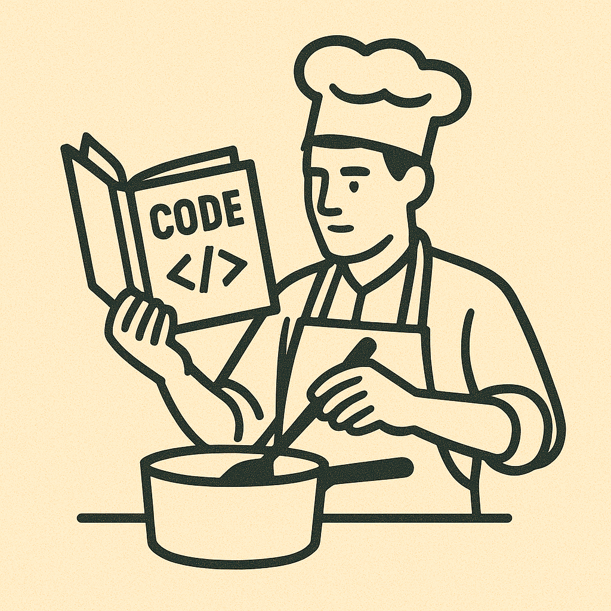
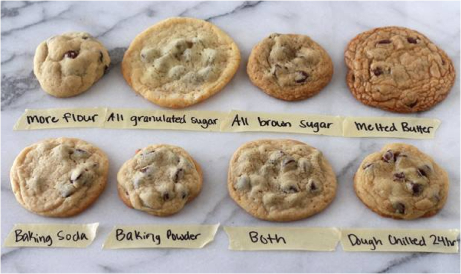
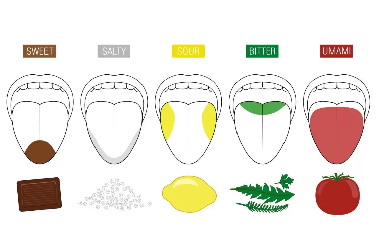
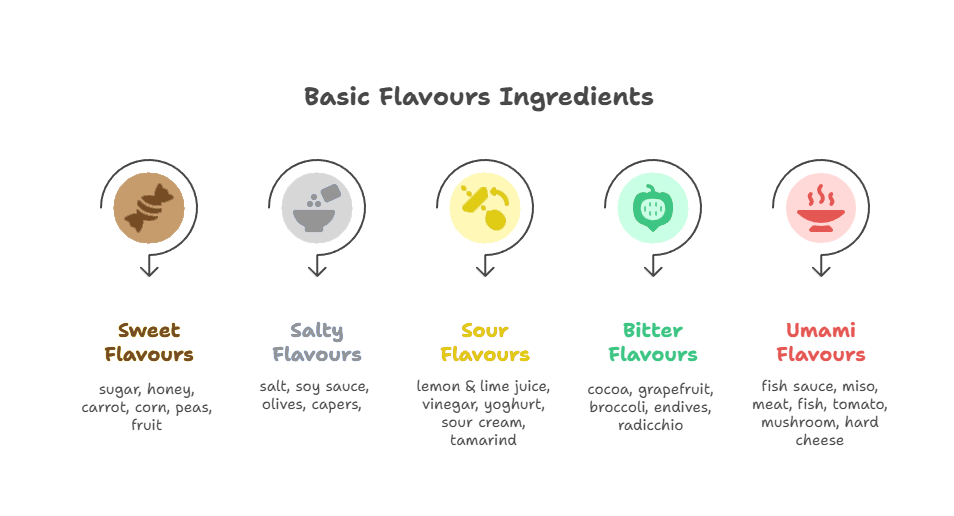

## A Favourite Analogy

Why *"Cooking the Code"*? Well these are two of the things I really enjoy doing, writing code and cooking. Cooking the code is not the same as [*"Cooking the books"*](https://www.investopedia.com/terms/c/cookthebooks.asp#:~:text=Key%20Takeaways,expenses%2C%20and%20pump%20up%20profit.), this is not something illegal just a fun analogy to explore. In this short post I will go into some of the interesting parallels I draw between cooking and software engineer, and also what cooking has taught me about how to approach software engineering.

## Baking: Code and Infrastructure

Writing in a programming language or configuring infrastructure is analogous to baking. Baking is precise and systematic. When following a recipe the amount of each ingredient, order of operations, and techniques you use are extremely important to the outcome of the final product. For example, if you don't correctly layer butter into the pastry for croissants, or if you don't keep the butter cold enough, they won't rise into perfect flaky crescents. The parallels should be clear here, when writing code, we must adhere very specifically to the [syntax](https://en.wikipedia.org/wiki/Syntax_\(programming_languages\)) and [semantics](https://en.wikipedia.org/wiki/Semantics_\(computer_science\)) of the language we're working with, otherwise it simply won't work. This is the same with configuring infrastructure, especially if we're using an [Infrastructure as Code](https://en.wikipedia.org/wiki/Infrastructure_as_code) service like [Terraform](https://developer.hashicorp.com/terraform). If we do anything incorrect, the configuration will be rejected and our lovely infrastructure cake will not rise.

Whilst sometimes a variance in the ingredient amount/type or process can yield a functional product, it will never be "right". This can be seen with the variance in the cookies below:

You may likely have a preference of how you like your cookies, which will vary person to person. However, the cookie you desire is specific and to achieve it consistently the same ingredients and processes must be followed each time without variation. Like writing software or standing up infrastructure, there is variance that could be made, but to reach the specific desired outcome the same steps must always be followed exactly.

## Cooking: Architecture and Design

Unlike baking, when cooking there isn't always a set recipe with specific amounts of ingredients you should follow. Cooking a dish is significantly more free form, you need to taste the dish as you go and determine what adjustments must be made in order to direct the dish for your vision. With baking, the parameters you can tweak are very limited:

* If something needs hydration, you will add water
* If something needs sweetness, you will add sugar
* If something needs richness, you will add egg or butter

However, when it comes to cooking it is more nuanced and expansive. Often dishes are balanced around the 5 basic flavour groups:

But within each of these groups, there are a plethora of options which add one or more of these flavour aspects to your dish. So the achieve a balance there are significantly more permutation of what can be done.

When choosing an ingredient, you need to also consider it have its own unique flavour profile, texture, and cooking methods. This means that there is more than just broadly balancing the ingredients added to a dish between these 5 groups.

In my opinion, this is the balancing ethos needed for architecture and design. It's a significantly more creative space than code and infrastructure. There is almost never one "right" answer, and you need to know the right ingredients to grab for when balancing pros and cons to reach your vision. For instance, should we use synchronous (REST APIs/RPCs) or asynchronous (Events) communication? Should we use relational storage (SQL), document storage (NoSQL), something else (GraphDB)? For data presentation, should we use [CQRS](https://microservices.io/patterns/data/cqrs.html) or [API Composition](https://microservices.io/patterns/data/api-composition.html)? Different recipes you build are going to need different balances of characteristic flavours, so you need to experiment and gather experience. In cooking, sometimes you add too much of a wrong ingredient, things will go wrong and you need to start over. Not every dish is going to come out good, but you can take learnings from the failure to improve what you cook up next time!

## Tasting: What I've Learnt

One of the key things cooking has taught me is to always keep a vision of the final product at all times throughout the process. When constructing a dish, the foundations of it will sometimes start 1 or 2 days before the dish will be finished (i.e. [brining meat](https://en.wikipedia.org/wiki/Brining) for a slow cook). However, for this planning you need to ensure that each step you take goes towards the final dish, up until the point you're arranging the elements on a plate.

Finally, the other important thing it has taught be is to be mindful of timing during the building process. When cooking a dish, all elements need to be finished at the same time to ensure the final dish is correct. Likewise, with architecting a system, the order of implementing the elements must be precise to ensure success. In order to get this right, pre-planning is the key. With cooking, this usually comes in the form of a [prep sheet](https://www.theculinarypro.com/kitchen-prep), for software, this will be your [rollout plan](https://handbook.gitlab.com/handbook/engineering/development/processes/rollout-plans/).
