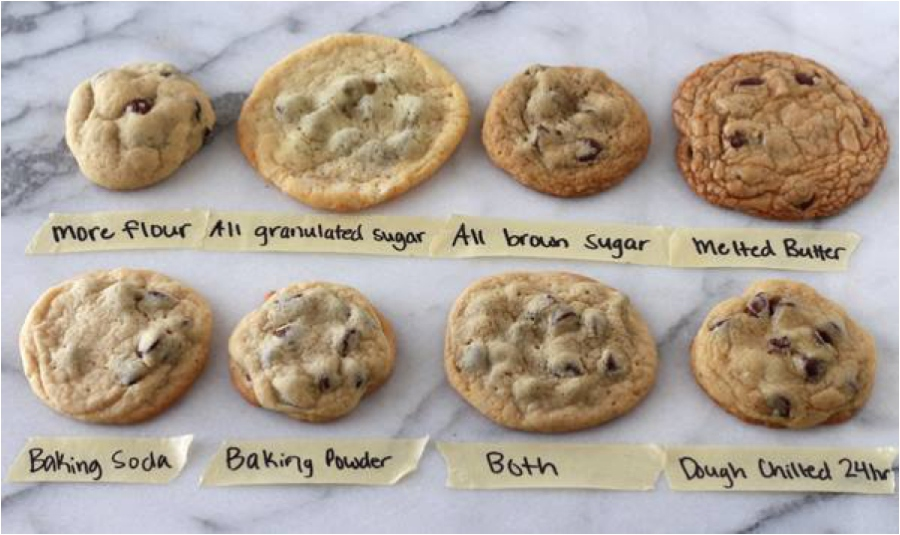

## A Favourite Analogy

Why *"Cooking the Code"*? Well these are two things I really enjoy, writing code and cooking. Cooking the code is not to be confused with *"Cooking the books"*, this is not something illegal just a fun analogy. In this shorter post I will go into some of the interesting parallels I see between cooking and software engineer, and also what cooking has taught me about how to approach software engineering.

## Baking: Code and Infrastructure

Writing in a programming language or configuring infrastructure is analogous to baking. Baking is precise and systematic. When following a recipe the amount of ingredients, order of operations, and techniques you use are extremely important to the outcome of the final product. For example, if you don't correctly layer butter into the pastry for croissants, or you don't keep the butter cold enough, they won't rise into perfect flakey cresents. The parallels should be clear here, when writing code, we must adhere very specifically to the [syntax](https://en.wikipedia.org/wiki/Syntax_\(programming_languages\)) and [semantics](https://en.wikipedia.org/wiki/Semantics_\(computer_science\)) of the language we're working with, otherwise it simply won't work. This is the same with configuring infrastructure, especially if we're using an [Infrastructure as Code](https://en.wikipedia.org/wiki/Infrastructure_as_code) service like [Terraform](https://developer.hashicorp.com/terraform). If we do anything incorrect, the configuration will be rejected and the lovely infrastructure cake will not rise.

Whilst sometimes a variance in the process or ingredients can yield a functional product, it will never be "right". This can be seen with the variance in the cookies below:

You will likely have a preference of how you like your cookies, which will vary person to person. However, ultimately the cookie you desire is specific and to achieve it the same ingredients and process must be followed each time without variation. Like writing software or standing up infrastructure, there is variance in the outcome but to reach the desired outcome, the same steps must always be followed exactly.

## Cooking: Architecture and Design

*NOTES*:

Cooking Code
0\. Fun analogy because they're 2 things I like. "This is not the same as cooking the books"

1. Code itself is like baking, you need to follow a recipe, and order/process matters. I.e. you need to whip the egg whites first, just like you need to correctly process data structure (?)
2. Architecture and design is like cooking, you need to taste as you go, and there is no "right way" just what is your taste preferences (i.e. business use cases)
