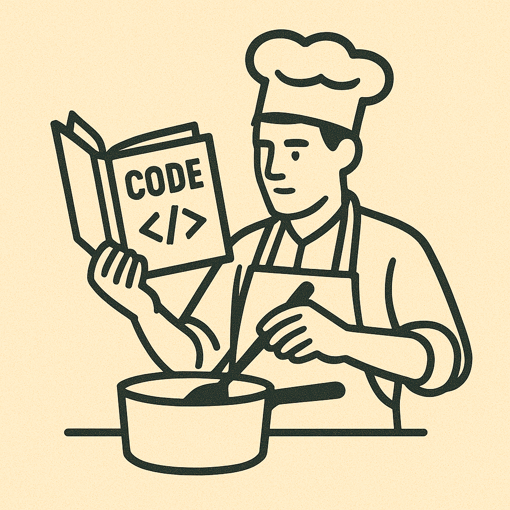

## A Favourite Analogy

Why *"Cooking the Code"*? Well these are two things I really enjoy, writing code and cooking. Cooking the code is not to be confused with *"Cooking the books"*, this is not something illegal just a fun analogy. In this shorter post I will go into some of the interesting parallels I see between cooking and software engineer, and also what cooking has taught me about how to approach software engineering.

## Code and Infrastructure

Writing in a programming language or configuring infrastructure is analogous to baking. Baking is precise and systematic. When following a recipe the amount of ingredients, order of operations, and techniques you use are extremely important to the outcome of the final product. For example, {TODO}.

## Architecture and Design

*NOTES*:

Cooking Code
0\. Fun analogy because they're 2 things I like. "This is not the same as cooking the books"

1. Code itself is like baking, you need to follow a recipe, and order/process matters. I.e. you need to whip the egg whites first, just like you need to correctly process data structure (?)
2. Architecture and design is like cooking, you need to taste as you go, and there is no "right way" just what is your taste preferences (i.e. business use cases)
