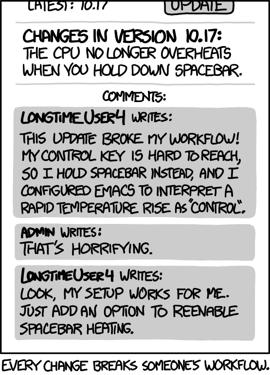

# A Few of My Favourite ~~things~~ Concepts

This is just a small collection of some of my favourite concepts or ideas that I've come across in my engineering journey. Some of these are well known and you'll likely know about them already, some are less common (in my experience), but all are worth knowing about.

## Hyrum's Law

[Hyrum's Law](https://www.hyrumslaw.com/) is an observation about software systems, in particular APIs. It states that:

> With a sufficient number of users of an API,
> it does not matter what you promise in the contract:
> all observable behaviors of your system
> will be depended on by somebody.

Or more easily explained, like everything in software engineering, by an [xkcd](https://xkcd.com/1172/):

The original law was made about low-level APIs, however, this is true at every level of abstraction. Here an API references any type of communication between a user of a system and the system. This could be:

* HTTP Request (SOAP, REST, RPC, etc.)
* Events messages
* Functions
* Objects/Classes

What this ultimately ends up outlining is a lack of communication or documentation that exists between 2 disparate groups of engineers. At some point, you can't control and change every piece of software, you must rely on others. As such engineers will do whatever is required to solve for their problems within their own domains, in some cases using the interface of a system not as intended.

The lesson here cuts both ways, you will always be a consumer of software as well as a producer, therefore you must always think about the other side of the interface. Ask yourself: "How does a consumer without deep context understand my system?" and "How would the producer intend for me to work with their system?". Keeping this understanding in mind at all times will also avoid the "throwing it over the wall" problem of being detached from the other side, and force you to work collaboratively instead.

## Dog Fooding

## Rule of 3s (The Software One)

Not to be confused with [rule of thirds](https://en.wikipedia.org/wiki/Rule_of_thirds) for artistic composition, this is a rule of thumb to avoid premature abstraction for items that may initially appear to share common characteristics, but in reality may not. The rule states:

1. is a nothing
2. is a coincidence
3. is a pattern

When designing you system to reflect real world constructs, it can be easy to write almost the exact same code twice and declare: "Ah! This should be abstracted"

## The 2 Hard Problems: Cache Invalidation and Naming
